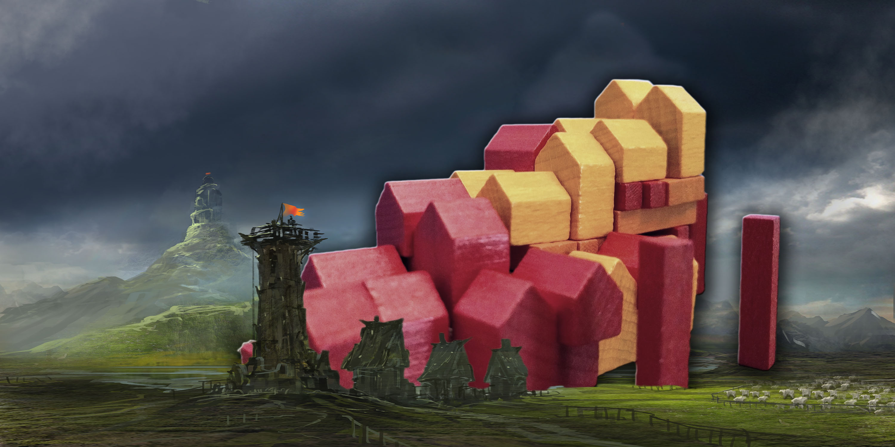

Elijah made a cool village, and we used Photoshop to put it into a fantasy
world.  The fantasy image is from Jeff Brown
at <a href="https://wall.alphacoders.com/big.php?i=579897">this link</a>.

Here it is:

Later, I thought about it and realized that dang it, his neat block city
should be more prominately positioned!

Thanks for having a look!

