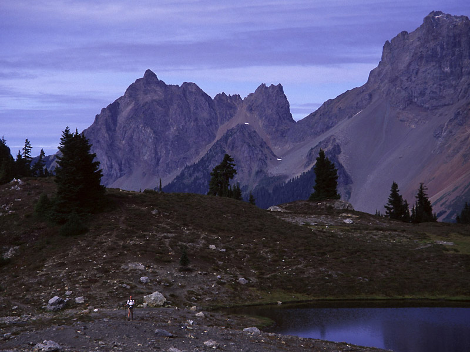
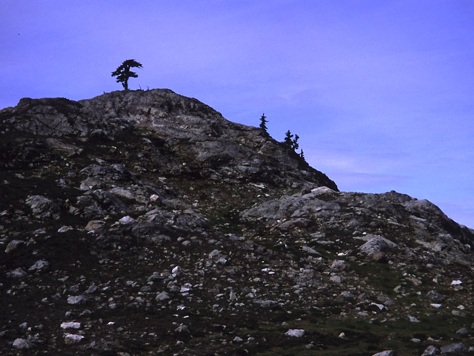
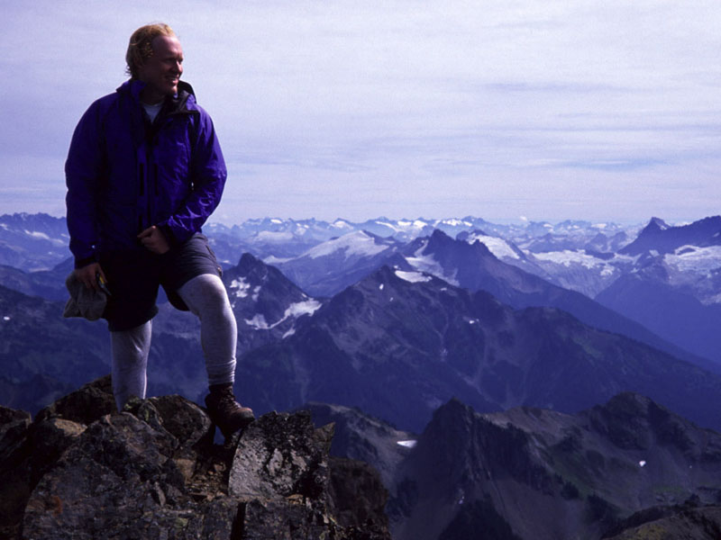
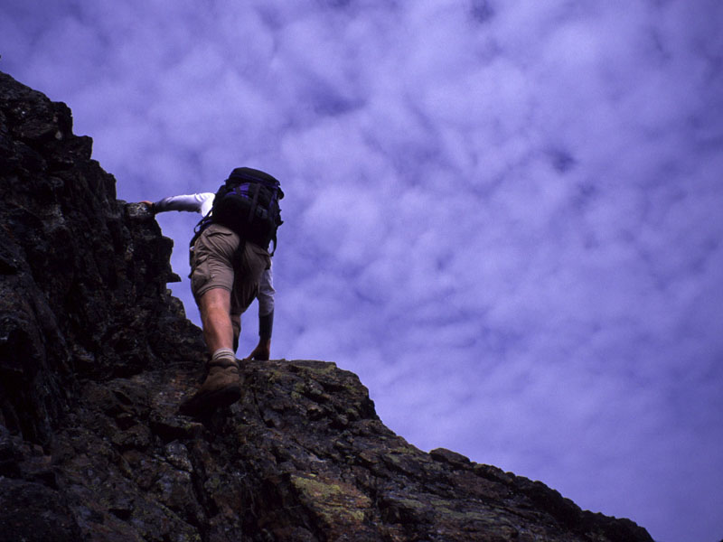
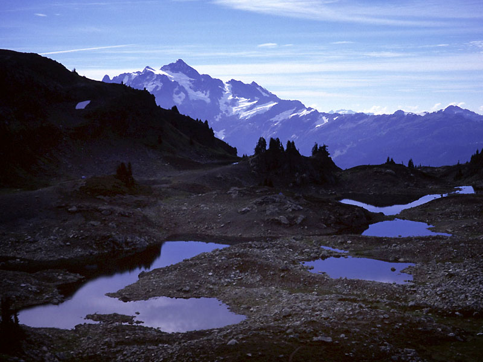
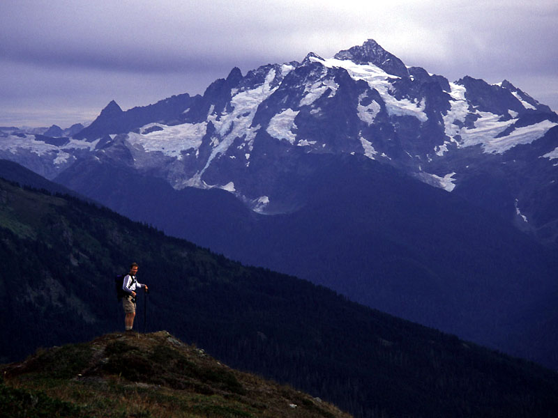
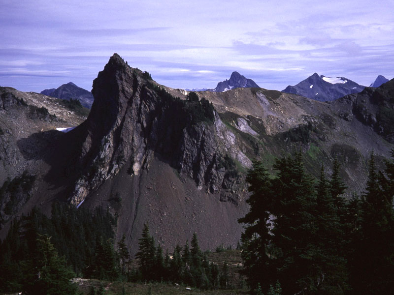
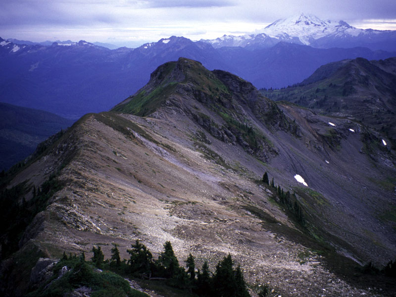

<h2>(and Yellow Aster Butte)</h2>
<h3>September, 2004</h3>

Theron and I hiked up Tomyhoi and Yellow Aster Butte in good weather Sunday.
Theron's more detailed report is <a href="
http://www.theronwelch.com/mountains/pnw/north/tomyhoi/index.htm">here</a>.

  

 
<i>Canadian and American Border Peaks.</i> 

  

 
<i>Lovely hillocks near Tomyhoi Peak.</i> 

  

 
<i>Michael on Tomyhoi Peak.</i> 

  

 
<i>Theron crossing a gable.</i> 

  

 
<i>Theron scrambling to the summit.</i> 

  

 
<i>Tarns with Mt. Shuksan in the background.</i> 

  

 
<i>Theron and Mt. Shuksan.</i> 

  

 
<i>Yellow Aster Butte.</i> 

  

 
<i>Looking south from Yellow Aster Butte's summit.</i> 

