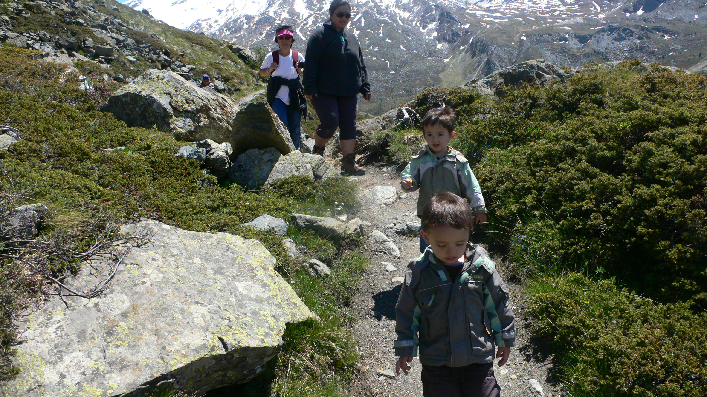

  
We had an awesome trip! We stayed in the Haus Ascott, had a nice apartment
where, shocked by the high prices in Switzerland, we resolved to cook every
meal. This turned out to be one of the most fun things. Kris invented a
dish with chicken wrapped in bacon. Mmm. Lots of red peppers and onions
too. Man it was good. Had many adventures with the boys, including a long
hike down a mountain ('bout 500 feet elevation descent, not too shabby
for 3 year olds I think).
  
  
I've got a Flickr slideshow [here](https://flickr.com/photos/ripsawridge/sets/72157605748481978/show/).
Kris will also have pictures, and I'll add the link soon.
