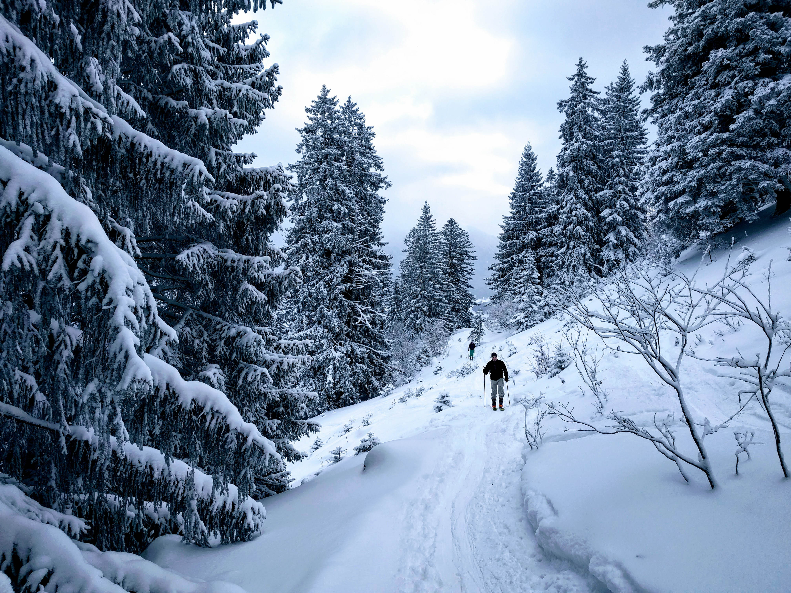
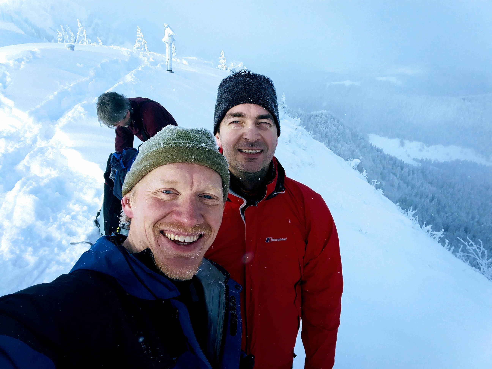

### Brauneck
_January 7, 2017_
I was back two days later; high avalanche danger kept me out of the higher
mountains. It's simply because the uptrack is such an enjoyable trail, I didn't
mind skiing on a commercial ski mountain. I repeated what Jaro and I did
exactly, but on the way down I stopped at a strategic point where the uphill
track has two variations. The one Jaro and I did was to skin steeply up
along the east side of a hill and the left side of a little-used piste,
and then follow a steep and narrow trail in forest until making a long
traverse west near the crest of the hill to a saddle above the Florianhütte.
But the other route traverses below this hill on the south to reach the
hut itself, climbing very slowly, and then rejoining the other route at
the saddle. So I applied my skins again (elevation here is 1100 meters)
and went to the Florianhütte and from there to the summit. 

This gave me a total elevation gain for the day of 1300 meters, which was
fine. I was in fact, well-pleased.

### Brauneck
_January 5, 2017_

Jaro and I skied up Brauneck today from the Wegscheid Draxlhang lift. Kris
and I taught the boys to ski here, it brought back memories. Today, Jaro
and I followed the ski touring trail, which was excellent...it largely
avoided the piste in favor of quiet trails in forest. Also, they were
trails and not roads, which I really appreciated.

