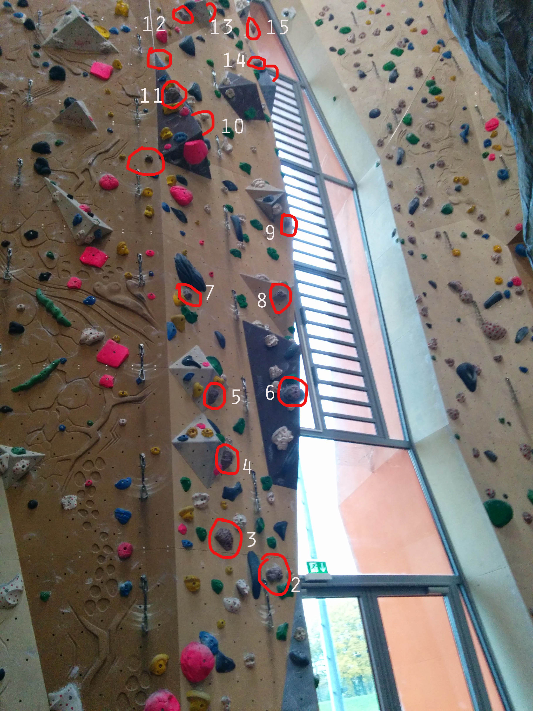

I've been having a great time lately in the climbing gym. With Jaro, Josef or
Hannes, we go in the morning and work some routes. I wanted to remember the
crazy level of obsession I bring to it by writing down my memorized moves for a
climb I recently led clean (without rests or cheating). It's 8- on the UIAA
scale, which is about 5.11c. What a fantastic climb it was! I thought about it a
lot when I wasn't on it. I knew every move. Here is my story:

---

Working on this route Kauziger Vogel (8-, pink)

Lower section: Not difficult until the roof. At the roof, stand confidently to
hold "pipe" and reach for left hand hold above roof. Clip.

Now, right foot on indentation, then huge twisting reach to the upper
right. Grab that, update feet to one hold above roof on the right and left foot
carefully placed on the "pipe" below the roof. Left hand grabs hold on the left,
right hand grabs sharp/marginal hold on the right. Clip.

Crux begin: Left hand up to big hold, left foot up, right foot...I'm uncertain
of what to do exactly here.

I think the next right hand hold is Painful Crimper #1. Right foot goes on
Sharp/Marginal. Left hand on Painful Crimper #2, left foot, who knows.

Right hand on Shark Fin feature, feels like "Thank God hold". Clip.

Left hand on Flat Feature Left. Left foot stays low, in Pocket. Right hand on
Flat Feature Right.

Idea here is to reach up with left hand to a pink hold. Right foot goes up
somewhere, and left foot pastes on slab. Right hand gets good-but-small hold.

The key now is to place the left hand on the left wall, lean on it, stand up
high, and thusly reach a big-good pink hold with the right hand. Left hand comes
over to match on this.

Clip.

Here my memories get fuzzy, but the idea is to maximize use of features, to use
the left wall for a pasted foot or a hand to lean on, at times extremely. The
next rest point is a feature hold on the right. If you made it here, you are
probably home free.

Feet are continually an issue on this climb. They are often hard to see because
you are right next to the wall all the time. It often seems that the footholds
are on overhangs or otherwise in awkward locations.

===

Now I have a new project, rated 8 (5.11d/5.12a), which provides fantastic
fun. Here is a picture:

My description as of now. I haven't led it clean yet, but I hope to:

Start is not too bad, gets interesting once you are in a V trough. Must get
right foot on lower left foothold to reach high left handhold on wall.

Next, left foot goes directly above on barely visible foothold (it's underneath
a structure triangle from your point of view), right hand presses on right hold,
and you stand up and reach up and right for the next hold.

Once you gained that, you have to make use of the right structure edge to step
higher, feet are on a sloping triangle. A bit more work gets you to a position
where your next hold is far on the left at shoulder level. It's tricky (core
strength) to touch it, but once you do your object is to get DIRECTLY BELOW IT.

This isn't so hard with some fancy footwork. Your feet are on a slopy
triangle. Reserve the far left edge of the triangle for your right foot, which
crosses over the left foot. Now the left foot goes out in space left, and you
can shift your center of gravity to below the big handhold on the left.

Grab it with both hands, swing underneath, work to get your left foot on a high
small foothold, and left hand up to a large left handhold on the same long
vertical triangle as the main handhold.

Now heel hook the right foot on the right side handhold, scrabble with fingers
on the structure where the triangle merges into the face, and work to get your
right foot to a standing position on that right side handhold. Once this is done
you can push up on that right leg to stand up.

Grab a handhold on the face. I think with right hand, then left, adjust your
feet high so the left foot is on the triangle merging into the face spot, and
right foot on the left facet of a structure triangle on the right. Right hand on
a higher hold, but keep room to match and let the left hand take the spot.

A crux move here. You need to bring your left foot to the self-same left facet
of the structure triangle, and move your right foot to the right side of
it. Then bring your left foot to that side too.

Then (core strength!) reach far right for a poor handhold, touch it and as soon
as possible, bring your right foot far right to heel hook a brown blob.

This hold you in to the wall. Pull your body into the wall, adjust the heel hook
into a foothold on the blob, keep center of gravity moving right and stand up on
that foot. You'll reach some thank god holds.

Along in here is a rest...milk it!!

Now some straightforward movement up. The next problem is to reach a handhold
far, far on the left.

Undercling a hold, feet on structure triangle slab, one foot goes far left,
stamp it and press hard to hold yourself into the wall. Move the center of
gravity left and grab the left hold before you fall off.

From here, it's all enjoyment. 3-4 more moves to the anchor.
