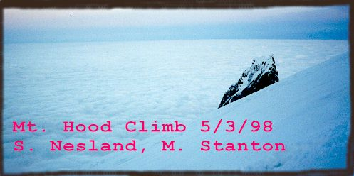
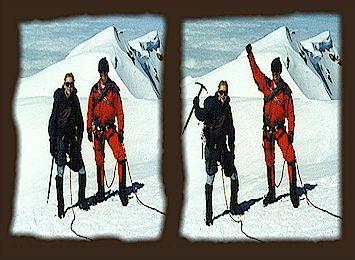
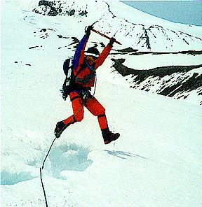
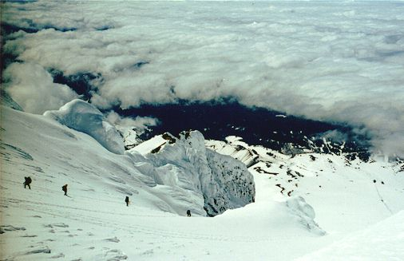
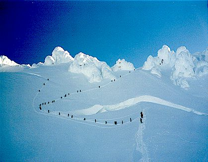
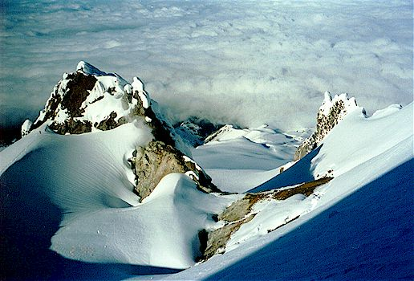
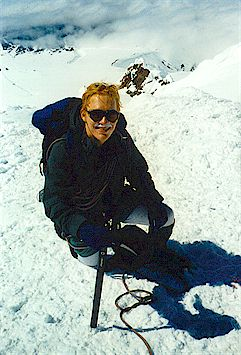

Allow me to introduce
Steve, a great guy who heads up the server-side
QA team in Intel's AnswerExpress division.  Kris and I worked with him while
we were there, and she discovered his interest in mountains.  I borrowed his
"Accidents in North American Mountaineering" books, and read them in wide-eyed
terror.  He also seems to have a penchant for books about Alaskan mountaineering
which end inevitably in missing toes and fingers!

Steve is happily married to Sarah, and they've spent a lot of time working on
their new home, leaving him with an excess of wanderlust he has to use up.  
That's where I come in, and recently we've had a great time learning, practicing
and executing our mountaineering skills.  In February we hiked up Mt. Defiance
in "near-blizzard" conditions, and in April we spent a weekend at Mt. Rainier
doing crevasse rescue and roped climbing practice.  

It's good to have someone
you can trust at the other end of the rope, and I can say that about Steve.

The plan for this weekend consisted of a day of more crevasse rescue practice,
and then a climb of Mt. Hood beginning in the wee hours of Sunday morning.  We
were very worried about the weather holding, and considered postponing the trip
until next weekend.  But if the weather was bad then, we wouldn't get another
chance for a long time.  So we gambled, and Kris and I drove down to Portland
in rain and clouds to meet Steve.  (This is after a week of 80+ degree temps
in Seattle, with clear skies...very depressing!).

Kris and I said goodbye, and she went to stay with Arwin in Hillsboro.  She got
a chance to sample our old favorite restaurants, something I envied 
while chewing
my endless peanut-butter sandwiches that weekend!  Our drive to the 
mountain was
uneventful, and we were happy to find that Timberline Lodge and the 
mountain were
mostly above the clouds.  Immediately, we got our gear out and 
trudged up to an interesting looking snow-cliff.

We spent the next 5 hours at this glacial remnant exploring 5 foot 
deep crevasses,
jumping them, punching through them, probing for them with axes.  We 
each jumped
off a cliff hoping our partner would drop and anchor themselves into the snow
quickly.  We used pickets and new big flukes that Steve bought to make decent
anchors.  Once, I had a picket and a fluke set as equalized anchors.  Steve and
I jerked on it as hard as we could, and finally, the deadman levered out, 
and the
fluke drove itself about three feet into the snow, where it would have 
held four of us.  All of this was very educational!

As evening approached, we packed up and headed down to the Mazama Lodge in
Government Camp, our residence for the night.  The weather, good so far, had
worsened such that it was raining heavily there, 2000 feet below timberline.  We
were met by the manager, Jason Starr, who gave us a nice (but cold) room and
waived all fees due to Kris's help with knitting last year.  We decided to wake
at 12:30 am, and for some reason were under the impression that he would wake us
up.  He didn't, but then again we barely slept and had no trouble waking.
Through the night, violent noises and piano flourishes, and pool games assaulted
us from various corners of the lodge.  A "retirement party" was held that
evening which must have involved pogo-sticks and stilts.  At 1 am, while eating
breakfast, Steve was surprised to find a group of mild-mannered women watching
TV right above our room.  He expected sumo-wrestlers based on the painful
crashes and whumps of an hour before!

We anxiously drove for timberline through fog and clouds, ever hoping 
to rise above
them.  Our wish was granted when we saw stars and a great black hump 
straight ahead.
We signed the register and got underway in the darkness, a few other parties
hanging around the parking lot.

Conditions were clear, cold and windy, with the wind dying down just 
before sunrise.  
We walked briskly to warm up, and then slowed down enough to talk.  
Since we were
hiking up a ski lift, grooming machines buzzed up and down the slopes, 
occasionally
coming so close that we'd point our headlamps at them and step 
aside.  They'd rumble
past in a cloud of diesel.  Steve dryly noted the paradox of climbing a 
mountain
at midnight only to feel like you're in an urban jungle coughing on fumes!

We made good time and stopped to stare at the Milky Way from time to 
time.  I first
saw it on a trip with my sister Tamara on the northern California coast about 7
years ago, and have been impressed by it ever since.  We saw a 
long line of headlamps far up around Crater Rock, and only three 
parties behind us.  We felt this boded well for the route above the Bergshrund 
because these parties would have descended by the time we got there, 
although this was 
not the case.  As the light grew, we rose above the ski lift and saw a 
beautiful "cloud sea" on the west.  (see the title graphic)  
The dawn sky was clear to the east.

Soon, we were overpowered by an evil sulfuric stench emanating from steam vents
in the crater.  We were right below a major vent called Devil's Kitchen, 
and both
felt brief stomach pains when the wind gave us a bitter mouthful.  Around this
time, several parties came down near us, giving up on the summit because of the
debilitating reek.  At least the views were becoming beautiful, with the soft
light of dawn casting a mountain-shadow on the clouds to the west.  
Illumination Rock looked incredible in the growing light with clouds behind it.

But we weren't to get off that easy.  The mountain extracted a toll from Steve,
who was stricken by more serious stomach pains as we got closer to Crater Rock
and Devil's Kitchen.  I hoped that by rising above the vents we'd be out of
their terrible waft, and Steve plodded on, puzzled by this unforeseen event.
He'd climbed the mountain several times without ill effect.

Finally we reached the Hogsback, a level ridge top crowded with climbers roping
up, talking and putting on crampons.  On the left, the slope drops off sharply,
constricted by snow-fluted rocks to what becomes the west face of the mountain.
The Kitchen's steamy vent awaits unwary climbers on the right.  Were one to fall
there, the fumes would overpower and render the climber unconscious before he
could climb out.

We spent an hour on that ridge, getting our harnesses on and coiling the rope.
The view was incredible, but we wanted to get well above the vents.  Steve later
told me he almost considered going down at that point, so weakened was he by the
fumes.  But once we were roped and entering the Chute he abruptly felt better!
This was a stroke of good fortune, because a health problem like this can blind
you to the beauty of a place much quicker than bad weather or tedium can...

We began moving up the Chute, taking care around the massive Bergshrund.  Steve
said it was much larger than in previous years.  I couldn't see the bottom of
it, but I knew it had taken many lives.  Best not to look!  We ran into problems
while directly over the huge crevasse, when parties wanted to use the little
snow trail to descent.  Steve and I moved off the path, careful not to let our
rope tangle with the descending climbers.  My legs grew tired of fastening me to
the snow wall, and exasperation set in when dozens of slowly descending climbers
rounded a bend above us.  We would be stuck there for 20 minutes, growing ever
colder!  We had seen a party of three climb straight up from the Hogsback (see
picture), rather than traversing above the Bergshrund.  The route was a steeper
wall of snow, but we were ready for a challenge.  A chance to escape the crowd
was not to be missed, either.

Steve traversed to the left and lead us up the Stairway to 
Heaven (also known as the Old Chute).  
The view was amazing, and snow-sculptures loomed on our right, providing
dazzling displays where the wind had carved the snow into beautiful shapes.
The route went up and up for 700 feet, and we finally emerged at a 
level tent platform.
The party of three who went this way before us came along and talked with us for
a while before descending.  We thanked them for kicking steps, 
saving us a lot of work!

The summit was 10 minutes away, mostly walking on the uppermost ridge 
line.  It was
9:45 am, and I was starving.  I ate a mushy peanut butter 
sandwich.  We could see
Mt. Adams to the north, and Mt. Jefferson and the Three Sisters to the south.
There was very little wind, so we stayed for quite awhile, ending up the last
to go down behind a large group.

While getting ready to go down, I sliced through a gaitor with my 
left crampon, which
was quite irritating.  The snow was softening, and after some hasty pictures we
were ready to go.  The crowd on the summit had disappeared, and we were the last
to go down.  It was a bit unnerving, as I didn't feel the crampons were useful,
because snow balled up tremendously on them, and they didn't bite very well in
the soft snow.  But we made it to the Hogsback, avoiding a crevasse which had
opened up on the route.  By this time it was incredibly hot, with the crater
bowl acting as a huge oven.  We talked to a few people, unroped and 
started down.
Almost immediately, we were able to glissade, and sped down several thousand
feet in minutes with this technique.  

After the glissading, we had a mile long "Death March" 
as Steve put it.  It was
almost 2 pm, and I especially was exhausted after 12 hours of climbing and a
sleepless night.  Resting fairly often, we arrived at the car just after 2:00.
We were speeding down into the clouds for a Slurpee (TM) by 2:15 pm.  Although
we didn't find one, we did find Coke and "Salt n' Vinegar" chips!

Thanks for a fun climb Steve!

