Arwin and Joey were visiting us from Los Angeles for just a few days. They had a great time at the Oktoberfest and exploring Munich. They had one day to go for a hike, so I took them to the Stubai Mountains after some hemming and hawing about where the best weather might be. When we woke up it was raining in Munich, and we almost cancelled the trip. I'm glad we didn't, because it was excellent!

We drove through Garmisch and Mittenwald, finally seeing some high cliffs as we headed south towards the Inn valley. The weather got even better, so we followed our noses into the Sellrain valley and decided on the hike to the Westfallenhaus. I had been to the area before on a ski tour, and remembered the view of the glaciated Liesenser Fernerkogel to be really impressive.

We enjoyed seeing waterfalls on the valley walls, and then had to practice our pacing skills as we hiked more steeply up the valley on the right. It rained for about 15 minutes, but then clouds alternated with sun for the rest of the trip, making for some dramatic scenes. When we reached the hut, we were sad to see that today it had closed for the season! And we were all out of Landjaeger sausage! However, there was a "winter room", where we could throw some money into a slot over a door and take some beer and apfelscholer. We walked a bit past the hut and found a nice rock to sit on and look at the expansive views.

Finally we got cold and headed back, making a little loop trip to reach the car in a different way. We topped the hike off with an amazing meal in Innsbruck. It had the best soup we'd ever had, among other things. Even the coffee was outstanding. Arwin got to drive us home - it was her goal to drive the Autobahn, and she did great!

Thanks to Joey and Arwin for a fun relaxing day, with amazing scenic beauty! 

<table>
<tr><td>
<a href="images/abovehut.jpg">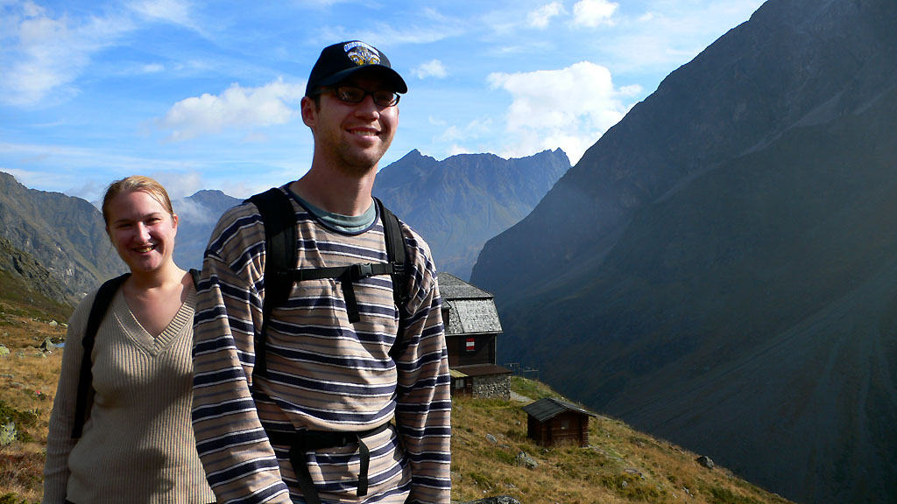</a> 
<i>Joey and Arwin above the Westfallenhaus</i>
</td></tr>
<tr><td>
<a href="images/abovetown.jpg">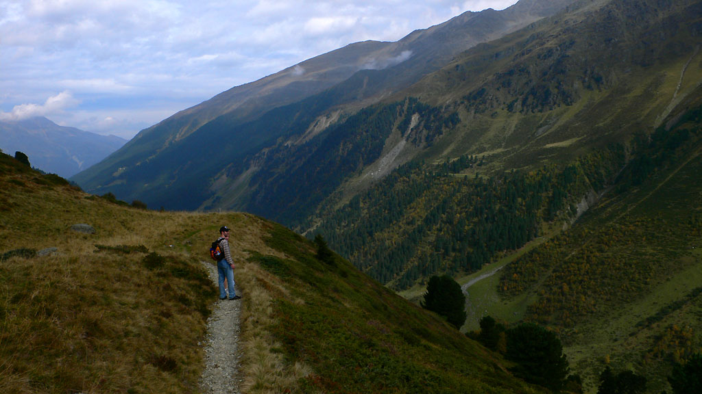</a> 
<i>On the way back to the car.</i>
</td></tr>
<tr><td>
<a href="images/arwinhikin.jpg">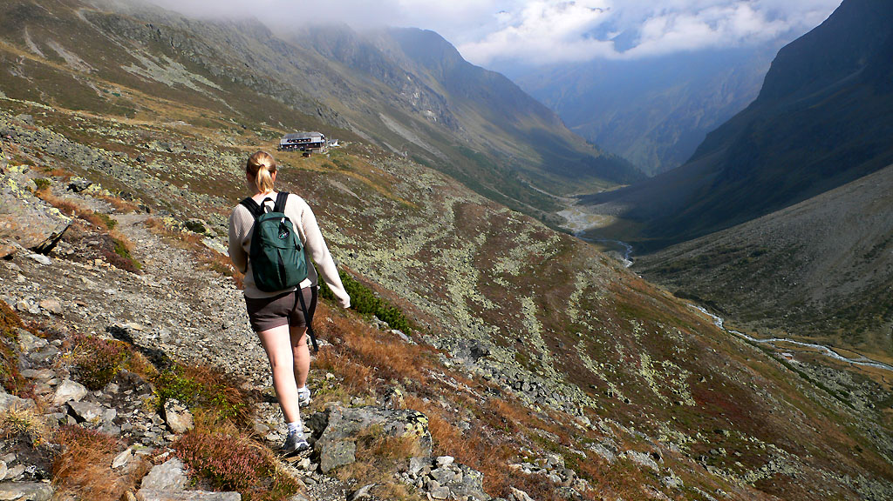</a> 
<i>Arwin returning to the Westfallenhaus</i>
</td></tr>
<tr><td>
<a href="images/bigslope.jpg">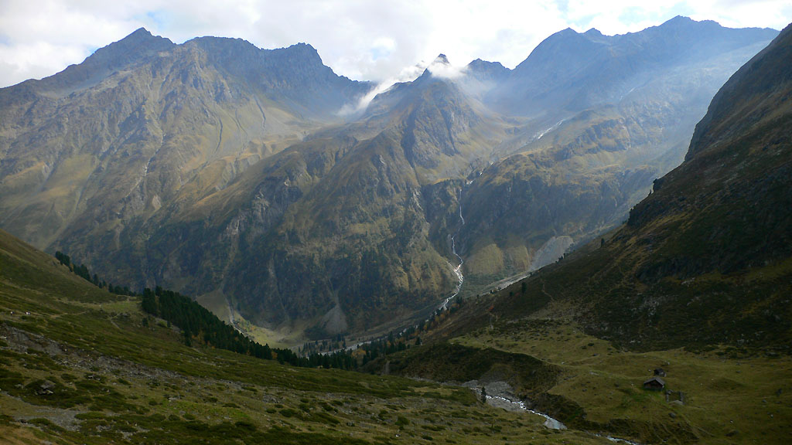</a> 
<i>Amazing waterfalls and valleys...</i>
</td></tr>
<tr><td>
<a href="images/churchtime.jpg">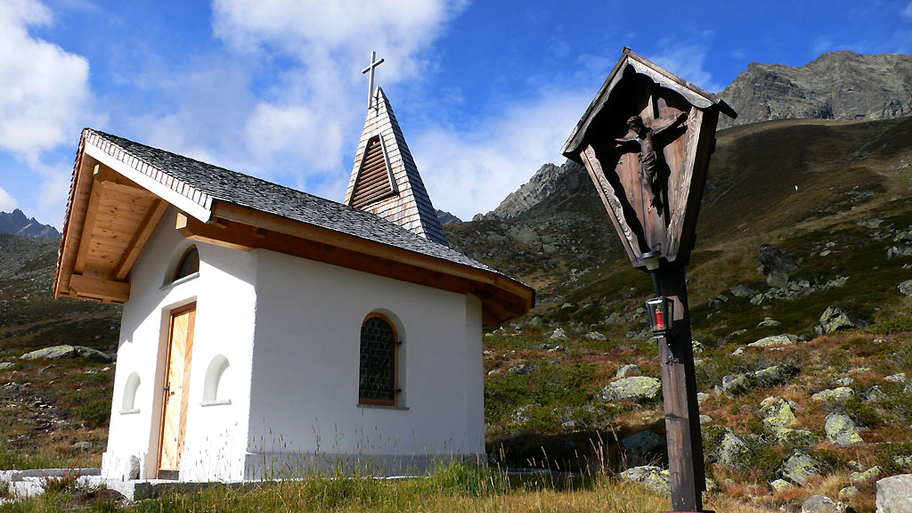</a> 
<i>A newly built church in the mountains.</i>
</td></tr>
<tr><td>
<a href="images/coolhike.jpg">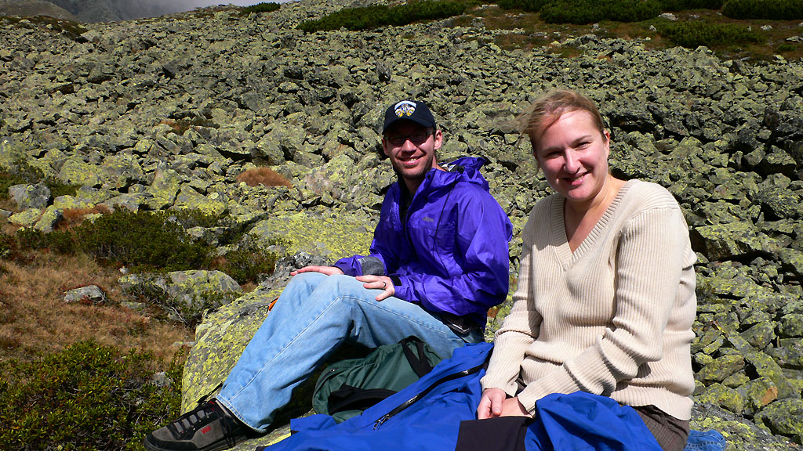</a> 
<i>We are pleased to be in the sun.</i>
</td></tr>
<tr><td>
<a href="images/goodslope.jpg">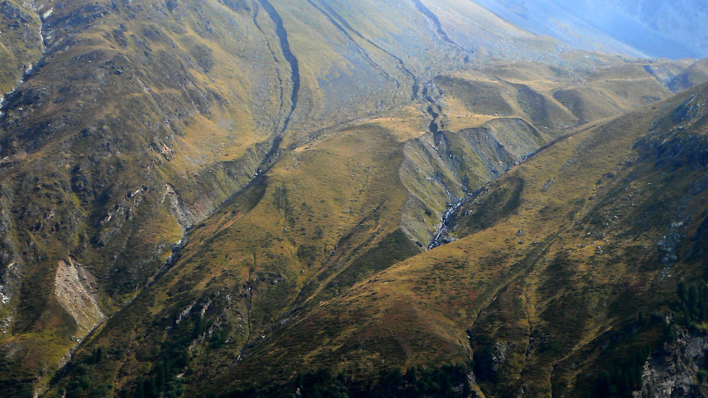</a> 
<i>Luxorious hillsides.</i>
</td></tr>
<tr><td>
<a href="images/inmeadow.jpg">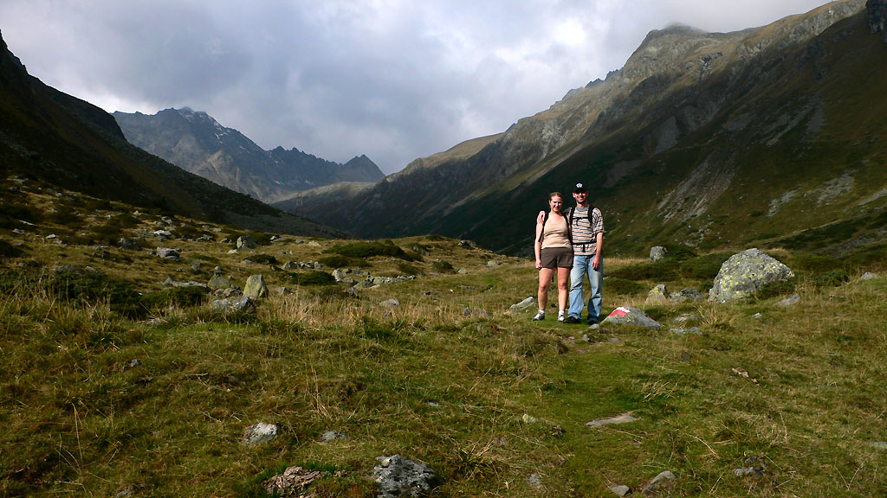</a> 
<i>Somewhere along the way.</i>
</td></tr>
<tr><td>
<a href="images/jandaontrail.jpg">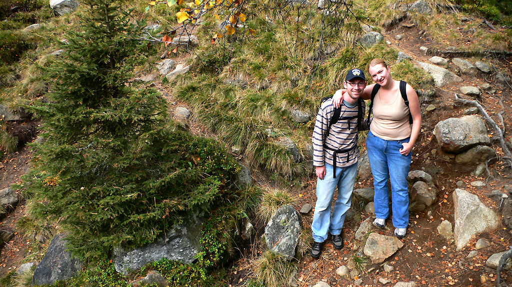</a> 
<i>Good friends who could make a visit.</i>
</td></tr>
<tr><td>
<a href="images/joeyhikin.jpg">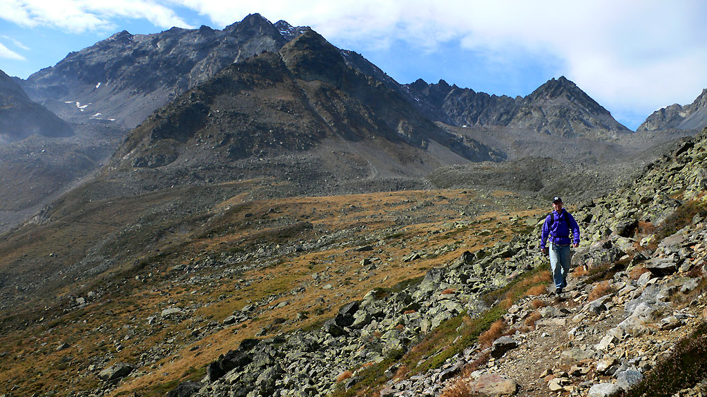</a> 
<i>Joey, like an Andean mountain runner.</i>
</td></tr>
<tr><td>
<a href="images/meadowhike.jpg">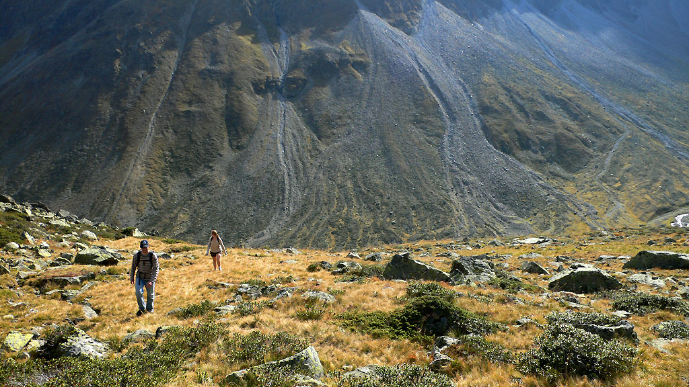</a> 
<i>Hiking to our secret rock in the sun.</i>
</td></tr>
<tr><td>
<a href="images/sombervalley.jpg">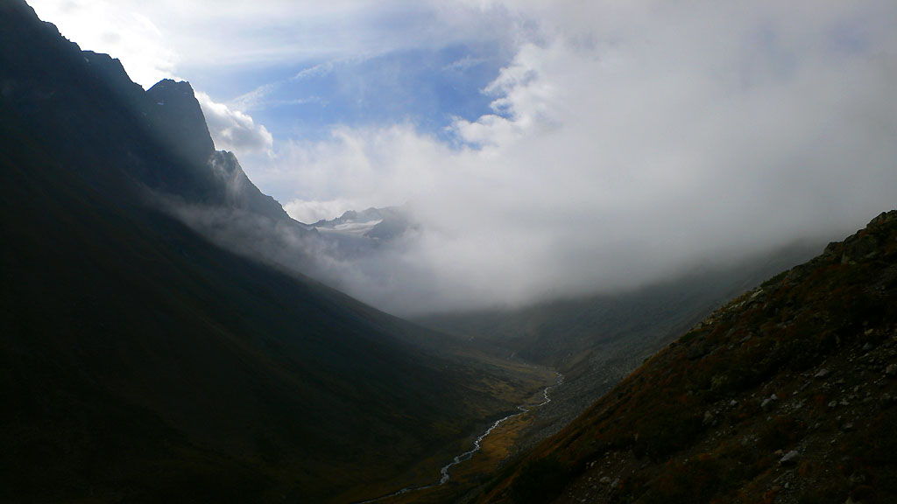</a> 
<i>I climbed the peak in the back last winter.</i>
</td></tr>
<tr><td>
<a href="images/sombervalley1.jpg">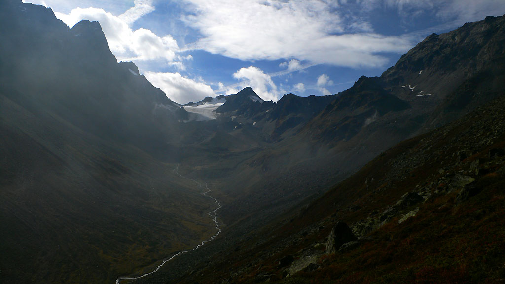</a> 
<i>Clouds invade then leave the valley!</i>
</td></tr>
<tr><td>
<a href="images/treenice.jpg">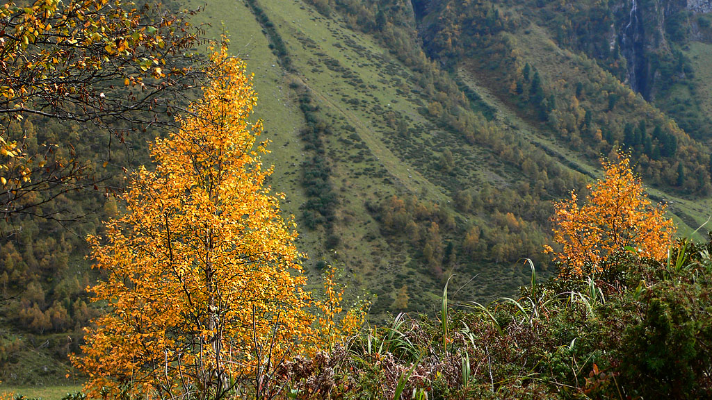</a> 
<i>An Aspen tree, or larch?</i>
</td></tr>
<tr><td>
<a href="images/waterfall.jpg">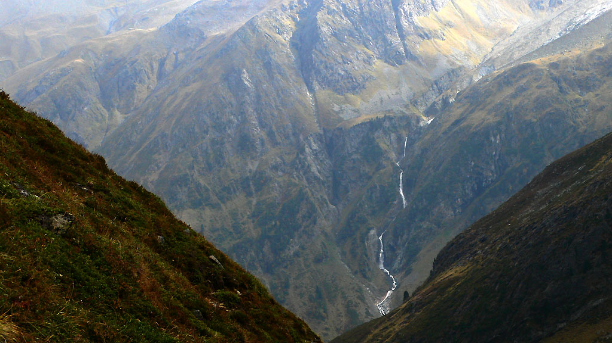</a> 
<i>Long waterfalls.</i>
</td></tr>
<tr><td>
<a href="images/zipperworks.jpg">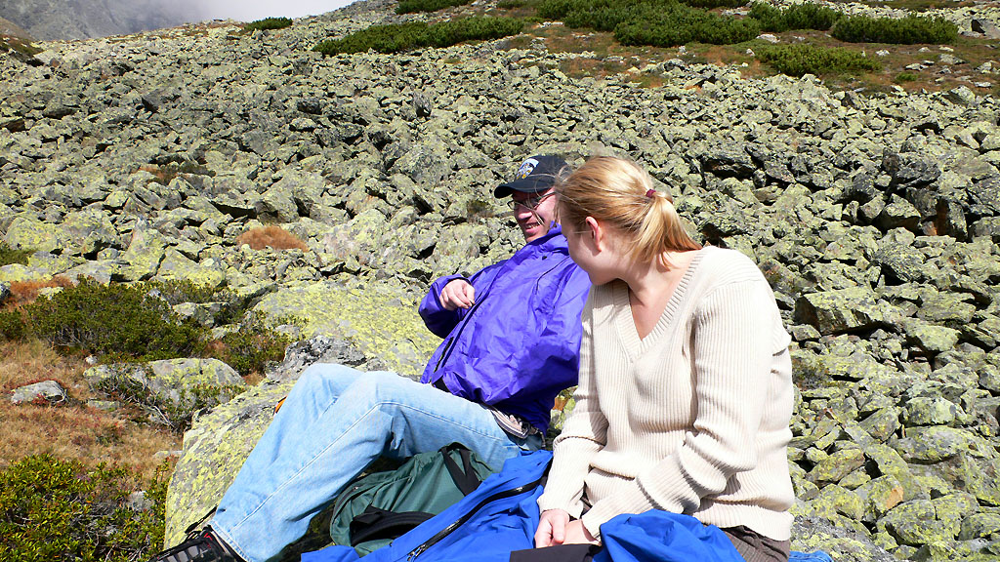</a> 
<i>Joey figured out the MEC zipper!</i>
</td></tr>
</table>
