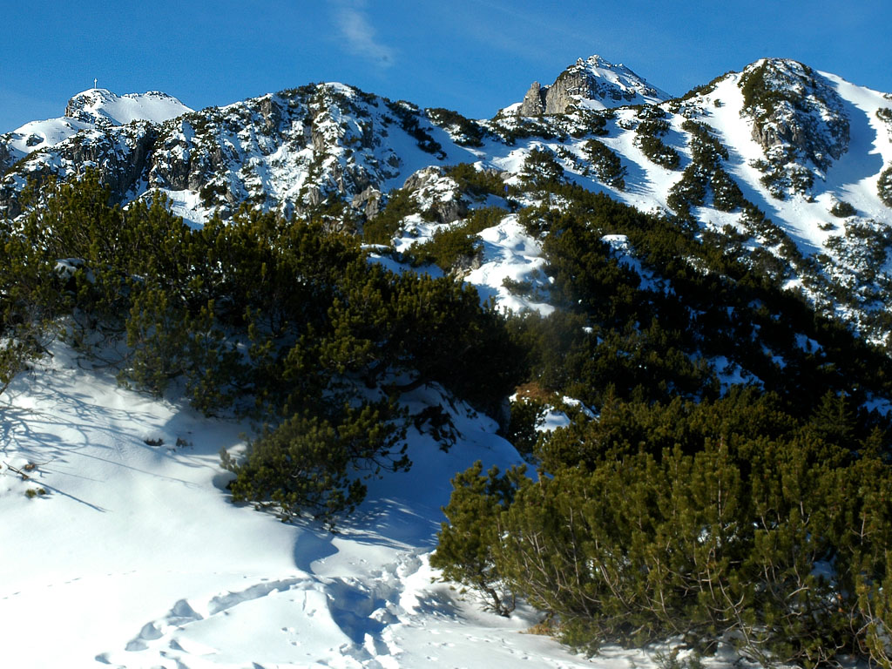
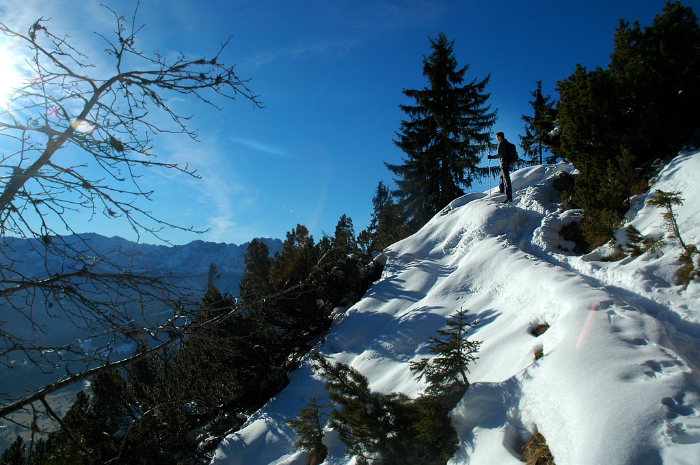
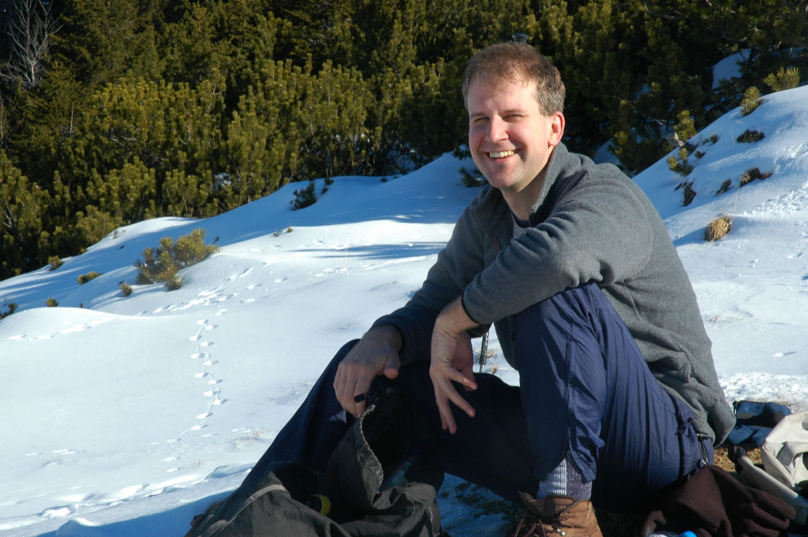
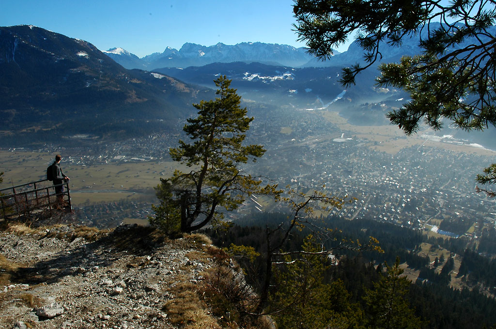
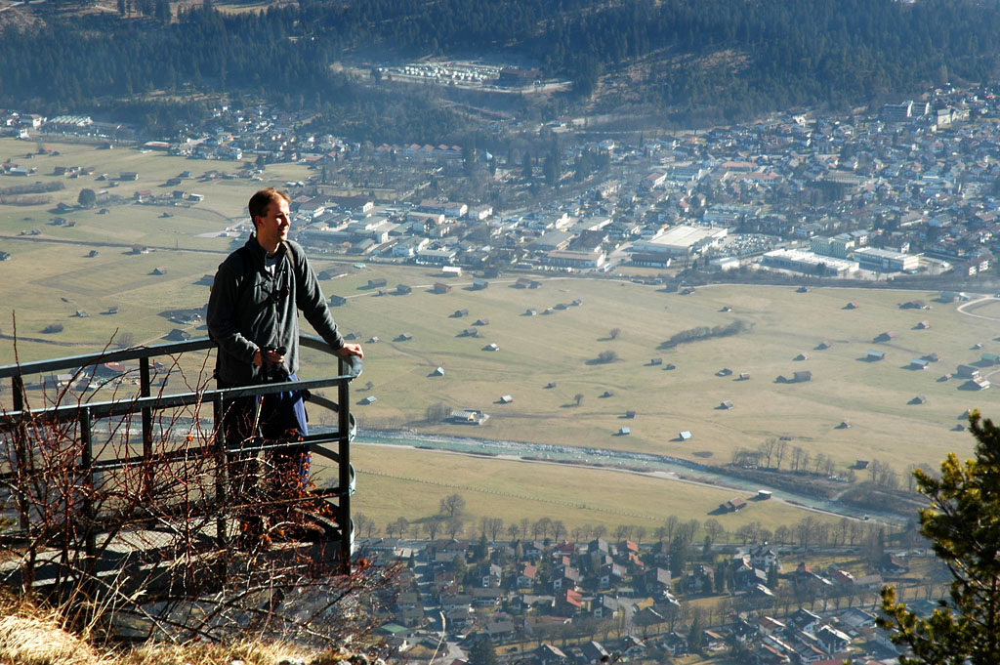

<h2>Snow hike with Steve</h2>

Steve K. and I went for a morning hike on the Kramerspitze. Steve lived in
Portland before Munich, and we had a lot of hikes in the Columbia Gorge in
common. Now a very busy father of three boys, he hasn't been able to hike
much. So it was a great boon that we had a blue sky morning to do it.

We made quick progress on the lower trail, as it was completely snowfree. This
is very unusual for this time of year! We were quite high when we finally hit
permanent snow, and then slowed down some. We had a turn around time of 10 am,
so we reached the ridge crest around that time and called it good. We sat and
looked around, enjoying the scenery very much.

On the way down, we stopped at the hut for a Radler. What a cool morning out!

<table>
<tr><td>
 
<i>The summit was still a ways away</i>
</td></tr>
<tr><td>
 
<i>A snowy perch</i>
</td></tr>
<tr><td>
 
<i>Steve at our highpoint, the ridgecrest</i>
</td></tr>
<tr><td>
 
<i>The Loisach caldron, with Garmisch-Partenkirchen</i>
</td></tr>
<tr><td>
 
<i>Along the way</i>
</td></tr>
<tr><td>
 
<i>The Hoellental with the Waxenstein in front.</i>
</td></tr>
<tr><td>
 
<i>Steve at a perch to contemplate the world</i>
</td></tr>
</table>
