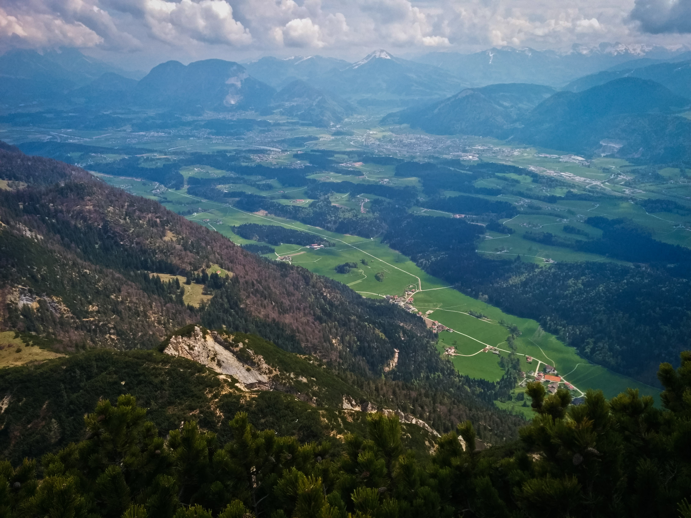
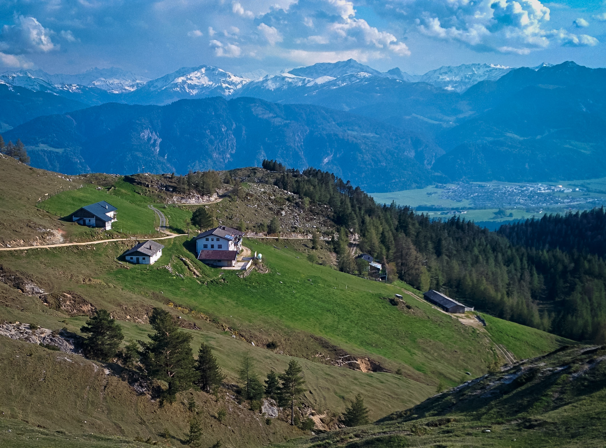
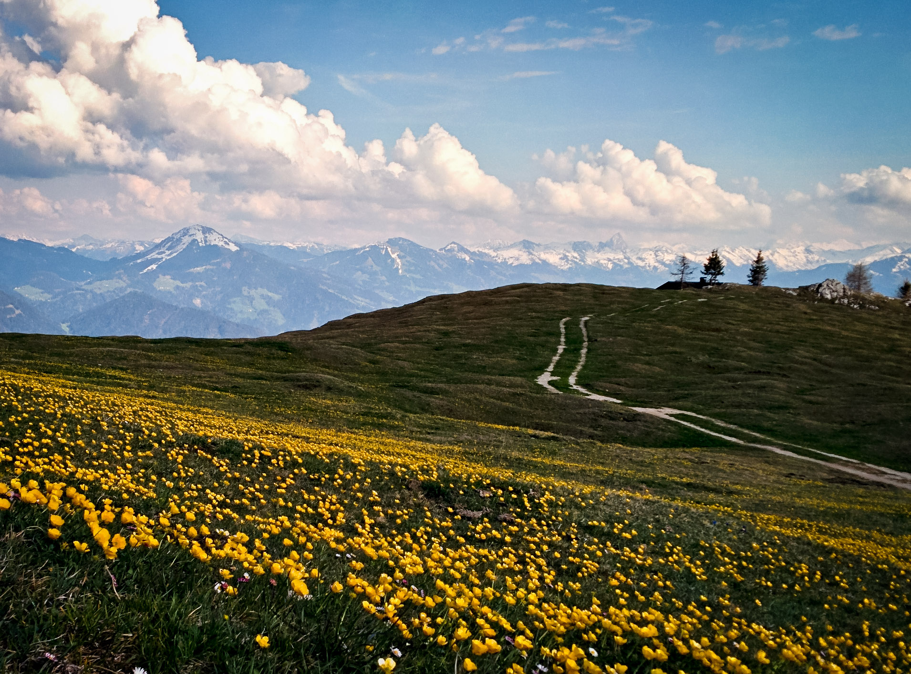
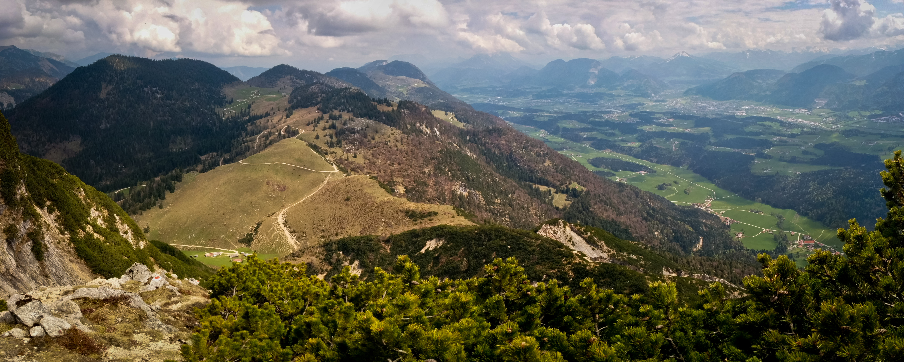
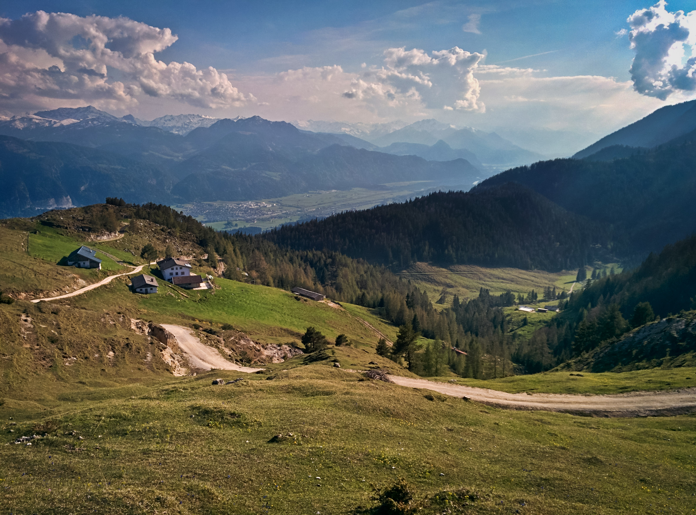

### Plessenberg and Buchacker Alm
_April 26, 2014_

Whew, more exploration of the Brandenberger Alpen! I was back on the trail to
the Ascherjöchl, and this time I continued up to the Plessenberg summit. In
answer to a small prayer, the cloud obscuring the summit all the way up
disappeared as I approached. Yes! So I could see the Inntal and all around. I
tagged the Heuberg summit too, just for fun. Looks like this was about 1400
meters up and down.

Back down to the car, then I drove to a shady meadow to make some delicious
salami, Kaiser Max cheese and Dijon mustard sandwiches. After about an hour of
taking it easy, I was ready for the second hike.

Clocking in at about 890 meters up and down, I followed a road from Embach up to
the Buchacker Alm, making my high point a little hillock shortly after the
division of the Hundesalm and Buchacker Alm roads divide (also marked by a bench
on a small hill). That bench was occupied by a cheerful biker, so I continued a
bit further hoping for expansive views to the north (partially successful). This
is a very beautiful high Alm which has a very "in the sky" feeling because it's
not dominated by still-higher looming peaks. I think the road walk is a bit
unfortunate, but at least it's very steep. On the way down I took some trail
short-cuts, but my god, they were nearly vertical tree-roots at times.

So, grand total of 890 + 1400 = 2290 meters, or 7513 feet, whew! What a nice day.

### Voldöpper Spitze and Ascherjöchl
_April 13, 2014_

I wanted some snow-free hiking, but I didn't know how high I'd be able to get before the snow got
deep. Also it was going to rain. I decided to do two 1000 meter hikes in order to get plenty of
exercise. I chose the Voldöpper Spitze above Kramsach, parking near a campground, and just hiking
up and down without even a pack or water, just an iPod. Mostly it didn't rain, and the summit
was nice, popping steeply out of the trees for decent local views. I returned the same way, for
about 3 hours round trip.

For my next hike, I looked at OruxMaps in my phone to see where to go next. To the east there was
a mountain called Heuberg. I didn't know if I could really do another 1000 meters, but I realized
I could make the Ascherjöchl my goal, and that would be around 800 meters. The hike up to Ascherjöchl
from Grub was hilariously steep on something like a wagon road for the first half. It started to
rain heavily but luckily I came to a small meadow carved out of the dense forest with a few houses
with covered porches. I rested a while and continued on steep and muddy trail that was tricky to
get down without slipping. At the pass there were good views and occasional sun. I wandered around
above the pass, settling for a rest on a 1500 meter hillside looking across to Heuberg.

The view:

and

These peaks were lonely mountains for the _Einheimische_ of the [Brandenburger Mountains](http://www.summitpost.org/brandenberger-alpen/602522).

### Rossstein and Buchstein
_April 4, 2014_

Hiked up Rossstein and Buchstein in heavy rain. I loved my trusty umbrella. The rain let up when I
had to use my hands for the scrambling, but the rocks were quite slick. The Tegernseehuette is
closed. Up and down in 2:45, 900 meters gain/loss.

### Wallberg
_March 23, 2014_

Riki and I hiked up Wallberg in a hilarious driving snow-storm. We were thinking those days are over
in this short and strange winter. Lots of trailbreaking on the road when it comes out of the forest.
The summit was a cloudy experience. Good times!

### 2 days with Timo

Timo and I skied up the Zwieselbacher Rosskogel in the Sellrein. Fun day! We broke trail for the first two-thirds
of the route, then stronger people came! Beautiful deep powder. We stayed in Gries that evening with a nice old
fellow. The next day we climbed the Bafflfall, good fun, then went to the Martinswand to climb the via ferrata.
I got freaked out with my slippery gloves, and ended up on a hiking adventure in the forest on the left side of
the Martinswand, following game trails up cliffs and steep forest. By the time I got back, Timo was waiting at
his van, like, "what happened to you?" Oh well, it all worked out on this nice day.

### Heimgarten
<i>February 15, 2014</i>

Fun, short hike. 1200 meters up and down. Movie [here](https://www.youtube.com/watch?v=qT3lh4dmPvM). And
[Gpsies track](http://www.gpsies.com/map.do?fileId=mgtebkebtudmwzdp).

### Bischof and Hoher Fricken
<i>February 8, 2014</i>

Super snowshoe hike, with an especially spicy hike down the Kuhflucht trail. Really nice day out.
<a href="http://www.gpsies.com/map.do?fileId=eyvbohufeczkwyke">Gpsies track</a>.

### Hochblassen and Ochsenaelpelekopf
<i>Feb. 2, 2014</i>

A great snowshoe hike today up Hochblassen, and then to the Ochsenaelpelekopf on
the other side of the valley. I ate lunch by the Jaeger Huette, watching the
snow come down pretty hard. It was a day of clouds and snow on and off. No views
from either summit. Fun anyway. 1400 meters up/down from the Ammerwald Hotel.

### Friederspitze
<i>January 18, 2014</i>

Snowshoe hike up Friderspitze. 1250 meters up/down.

### Forgot the name
<i>January, 2014</i>

Ski up a peak in the Sellrain with Josef, unfortunately ran out of time (and shape!), so didn't make the summit. About 1000 meters up/down.
                                                                                    
