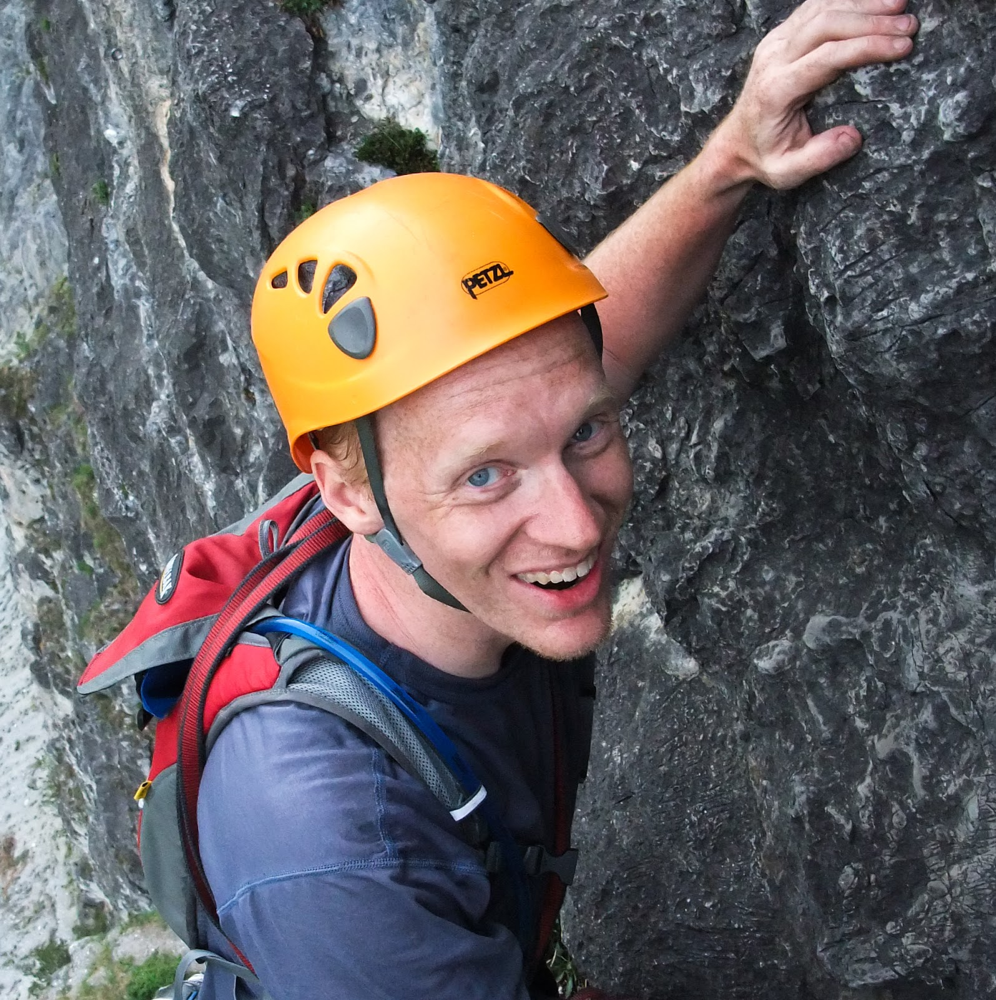

  

I am a software engineer working on the [Google][1] [Chrome][2] [V8][3] team in Munich, Germany, generally trying
to make the system run [faster][4]. Areas of current interest are Allocation Sites, which allow us to gather
feedback for specific initialization sites in JavaScript, and [Inline Caches][5] (*wonderful article by Vyacheslav*).

This site is primarily devoted to my [longtime hobby](climbing.html) of alpine
climbing. I learned to climb in Washington State, and moved to Munich in 2006 to
explore the Alps. I enjoy the mountain activities so much that I've [obsessively
recorded them](cma/) since the very [first](cma/1997/sainthelens.html) climb in
1997.

Occasionally I write on my [blog](blog/) about music, metaphysics, politics, books, or family strolls through the
Englischer Garten. We live in [Lehel][6], a quiet neighborhood just outside the Innere Ring, and love our local
[pizzerias][7], bakery and Thursday Kuchen Markt. My wife [Kris][8] and our [two boys][9] are also active in olympic
weightlifting. She is also a master [spinner][10].

[1]: http://www.google.com/en
[2]: http://www.chromium.org/Home
[3]: http://code.google.com/p/v8/
[4]: http://arewefastyet.com/
[5]: http://mrale.ph/blog/2012/06/03/explaining-js-vms-in-js-inline-caches.html
[6]: http://en.wikipedia.org/wiki/Altstadt-Lehel
[7]: http://www.r-cupido.de/
[8]: http://freimann-gewichtheben.org/
[9]: http://freimann-gewichtheben.org/2014-fruhjahrsturnier-im-mehrkampf/
[10]: http://www.etsy.com/shop/bockstarkknits
