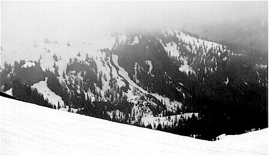
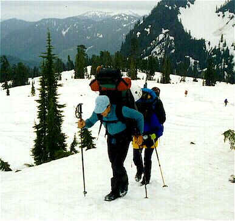
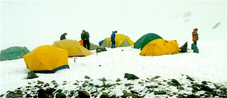

7/6/97 to 7/11/97

Cast of Characters
-------

* Paul: of two guides, former elite soldier, highly experienced climber and
backcountry traveller. I shared a tent with him for the last three nights of the
course.
* John G: One of two guides. 26-year-old lithe climber from the
Southwest. Patient, considerate instructor with an aura of impermeable cool.
* John: Client. A recent UW graduate, about to become an English teacher in a
small town near the mountain. I shared his tent for the first two nights of the
course. He joined the course at the last minute when two friends cancelled,
getting a free ride.  Irrepressably good-natured tall fellow.
* Wally: Oldest client. A very hardy man from Minnesota who climbed Rainer last
year. In his sixties, he out-performed many of us younger clients.
* Jim: Resident of the exotic Orkney islands, a semi-retired lawyer from the east
who chose to raise his family as far west as possible. New to mountaineering, he
did very well in the course, although he hurt his back Wednesday morning.
* Janet: Transplanted New Yorker turned LA outdoorswoman. A doctor, she had a
difficult time in the course, due to the never-ending rain and cold. She left
Wednesday evening, tenting with Jim for three nights.
* Ken: The "Big Canuck" from Vancouver B.C.. A most enjoyable and
well-conditioned wilderness traveller. Tented with Wally.
* Dennis: Dallas, Texas pathologist. A very good climber, he held up well under
the rotten weather. Dennis tented with Koby.

* Koby: Quintisential Texan, full of rolicking jokes and nicknames. He kept us all
in good spirits and closed the professional gap between us and our guides,
instigating wrestling matches and snowball fights with them. A dedicated
climber, eager to learn and fun to watch.
* Nick: Australian drifter, last known address in Georgia. Excellent climber who
maintained a wry sense of humor despite a miserable, leaking tent. This guy said
some of the funniest things in an offhand way.

Rough Overview by Day
--------

* Introductions, packing, rock climbing at Mt. Erie.  Beautiful weather,
car-camping after a good restaurant meal.
* Drive to Mt. Baker, wearisome 5 mile pack in and up to our 6000 ft. camp in the
snow on the mountain's south side, surrounded by glaciers. Socked in by clouds,
the rain started tonight.
* Late start due to rain, self-arrest practice, walking in snow lessons. I became
too cold and wet building a vestible for John's tent, and moved in with Paul
that evening.
* Snow anchor building with pickets, flukes and bollards.  Rope-team lessons, walk
across glacier to ice blocks and "French technique" crampon usage. Prussik
usage and ice-screw placement. The constant rain turned to snow tonight.
* Very cold, snowy and windy, the complex technique of pulley-based crevasse
rescue was practiced. I "rescued" Nick.
* Cancelled climb of Mt. Baker due to weather, and possible avalanche conditions
on the Roman Wall. An adventurous morning with crevasse-jumping and other
glacier travel techniques. I climbed down into a crevasse and out, standing
eight feet in on a discentigrating snow bridge.  Our guides "fell" into
crevasses many times, requiring rescue. Brutal, fast pack out, plenty of beer
and toasting back in town, and bus ride home to meet my patient darling!

Pithy Summary
-----------

Although the weather was so awful, with all suffering from
low-grade hypothermia at the end, and never even seeing the
mountain above us, all participants (except Janet) felt they
learned a great deal and that the course was worthwhile. I was
extra lucky  to tent with Paul, who in many
asides and observations taught a tremendous amount of information
on keeping warm and dry, and maintaining health in the mountains.
The course objectives were met, with an additional skill learned:
camping in wet, wintery conditions. The main drawback to the bad
weather is that we got less time to practice each new skill.
Hence, I must carefully outline what I've learned so I can
practice it myself.

Information Sources
--------

* Freedom of the Hills: Classic mountaineering textbook, with coverage of all
aspects of the sport
* Glacier Travel and Crevasse Rescue: In depth look at the topic, written by a former AAI instructor
* How to Rock Climb
* Climbing Anchors
* More Climbing Anchors
* Self-Rescue: Knots, pulleys,
harnesses...whatever it takes for a party to rescue
themselves.
* Climbing Ice: French technique for ice, and
detailed look at snow travel. Many advanced topics not
used in our course

More detailed notes
-----------

Lessons, by day:

### Sunday

harness, helmet, belay devices, rope (mountaineer's coil,
static vs. dynamic), figure-8 knot. Rapelling w/ Munter hitch.
Quiet feet, moving on rock, mantelling, stemming, hand/foot
jamming. Use legs more than arms. Shift weight from one foot to
another before each move. Mt. Erie top-roping. Belaying w/ Stitch
plate belay device. Anchors w/ Coer'de'lete, friends, tapers,
proper/improper placement. On rock you want at least 3 anchors.

### Monday

Drive and pack-in to base camp at 6000 ft. Operating stove.

### Tuesday

Late start. Walking on snow. Confident stride, duckwalk,
step-kicking, walking diagonally up slope, kicking footholds
moving from in-balance to out-of-balance position.

Use of ice-axe in above, as well as turning to make a
switchback. Walking down slope w/ plunge step. Glissading, w/
standing glissade emphasised as preferable. For steep snow
ascent, drive axe shaft in directly in front of you, pull
yourself up on it. You can go down in this position too.

Ice axe self arrest, from all positions. Also, without axe
trials.

Moved to Paul's tent tonight. Learned hot water bottle usage,
method of keeping things dry.

* Store things in garbage bags in corner of tent.
* Use a ground pad and a thermarest. Fold thermarest back, don't sit on it with
wet clothing! Keep sleeping bag back over it. Allow cheap ground pad to become
wet. This way, top of thermarest and bottom of sleeping bag do not get wet.
* At night, fold thermarest forward.
* Put socks over hot water bottles in sleeping bag, put in
other things you want to dry. Wear damp clothing to bed
to dry it.

How to always wake with dry socks with only two pair.

* Wear a pair, get them wet.
* Hang this pair up in tent that night and all next day.
* In morning, put on fresh pair.
* That night, hang formerly fresh pair, and put first pair
in sleeping bag with hw bottles.
* Repeat indefinetely.

Stove can be brought into tent to warm it...but be careful for
carbon monoxide.

### Wednesday

Snow anchors. Pickets can be placed vertical in ice or hard
snow, only if it takes effort to pound it in. Pickets are
normally placed horizontal in trench. Rule of thumb: dig trench
to elbow level. Rule of thumb for picket trenches and fluke
placement: place protection perpendicular to slope, then back off
10 degrees upslope.

Tie sling around picket, attach locking carabiner, gate
skyward.

Remember that flukes must be set before usage. Put axe shaft
into locking carabiner attached to fluke cord and pull hard.
Verify that fluke goes into slope rather than coming up and out.
The fluke is a dynamic anchor, picket and bollard are static.

The bollard should be at least 3 by 5 feet, teardrop shaped,
with overhanging lip at top to keep rope from slipping up.

With backup anchors, use a cor-de-lete preferably to
distribute load. If you don't have this, use a sling with a twist
in it. Tie a knot in the sling to make the anchor set
unidirectional. You want at least 2 anchors on snow.

After lunch, we learned that for a rope team in the northwest,
you want about 30 feet between members, with the extra rope at
each end in equal amounts. The rope team leader should prepare
the rope, spacing the figure-8 knots evenly. Everyone should
attach their prussiks to either the uphill or downhill side of
the rope, resulting in a 50 percent chance that they will have to
be moved in case of a fall requiring prussiking.

Walk with rope on downhill side, ice-axe on uphill side. Slow
down at the top of a hill to avoid wasting your followers.

We went to an ice-fall and donned crampons. Step-in Moser
crampons were used on my Scarpa boots. French technique for
walking on ice learned. Feet pointed downhill, bend body at knees
to keep weight distributed evenly over feet. Shuffle step or
delicately cross one foot over the other. Ice-axe can be used for
balance in horizontal or vertical position. In horizontal
position, be sure to really slam the spike into the ice wall,
holding your hand at the feurrule. In Pieolet Romp, slam pick
into ice ahead of you when descending, then "banister"
down the shaft until you grip axe at head.

French technique really uses the thigh muscles, rest on your
haunches when required.

Simulated crevasse fall practice. Dangle at end of rope with
prussiks attached:

* Remove pack and attach to rope with carabiner.
* Prussik up, make sure to fold legs at knee when moving
waist prussik up, otherwise pack can become too heavy if
weight is on arms too much.
* At the lip, watch for overhangs. Hopefully, partner can
throw rope ladder to get you over this, and they prepared
the lip well to prevent the rope from cutting deeply into
the snowbank.

Ice-screw placement requires chipping away of rotten ice to
solid layer. Place in perpendicular to slope, then up 10 degrees.
Use pick to create a small starter-hole. Remember, that the ice
around the screws melts only hours after placement due to
friction.

### Thursday

Late start due to weather (<em>again!</em>), and guide John
didn't arrive at camp until 10:30 AM. We learned pulley-based
crevasse rescue, needed when the victim can neither be hauled out
nor prussik out. Our mechanism was to first construct a Z pulley
(3:1 mech. advantage), then attach a C pulley (2:1) onto it,
giving a 6:1 mech. advantage. You need 2 flukes, 2 pulleys, your
prussiks, a sling or a cor-de-lete, about 4 locking and 4
non-locking carabiners, and your ice-axe to set this up.

It is very important to drop into self arrest when a sharp tug
is felt on the rope. Dig in with your heels! Hold the weight with
your feet while your hands set up the anchors. When pulling the
C/Z pulley rope, use your whole body and esp. legs to
haul...don't use your back...you'll tire out.

Stove problems were solved today, and Paul's method of keeping
a lighter working was seen to be very valid. He keeps it on a
cord around his neck next to his skin...keeping the lighter dry
and warm.

### Friday

The summit climb was cancelled at 12:30 this morning due to
heavy rain. We woke early and were on the glacier by 7. Paul and
John fell into crevasses several times, requiring either a
haul-out rescue, or in one case a pulley rescue (only Z I think).

Technique for crossing snow bridges: keep rope tight on
tester, when tester wants to move forward a step, follower takes
a step forward. Tester probes with axe, may go on all fours to
distribute weight. 

When walking around crevasses, the followers make two parallel
paths to avoid too many crossings on one possibly hidden
crevasse.

When stopping to rest on a glacier, stopping next to a
crevasse is preferred, since there is unlikely to be another
crevasse right next to it. Parties come together by passing slack
rope through their prussiks. This skill should be practiced while
walking, as it can be awkward.

Some crevasses can be stepped over, others can be jumped. When
jumping, get some slack rope, and say "1,2,3, *Jump!!*"
On Jump, entire team should jump. The slack rope the jumper
carries should make up for delay before other team members jump.
Stamp out a starting platform if needed, belayed from behind. Be
sure to jump at least a foot in from the edge, as snow might
crumble away there if any less. Do not fall after jump, try to
stand gracefully.

You can climb down into crevasses to cross them. I did this,
ending 8 feet in on a small snowbridge. This bridge crumbled when
I weighted it, and belay from above was helpful. Eventually, I
got out!! The rest of the team followed. Later, we made some big
jumps.

When crossing a glacier, try to move from compression zone to
compression zone, as these are the safest, most crevasse-free
areas. They can be found below a hill and on the inside of a
curve. Remember that new snow covers crevasses, and is not
consolidated, so it is more dangerous to travel a glacier after a
covering layer of snow.

At 12:30 we broke camp and headed down to the van. Paul
recommended some books, and suggested I become a Wilderness First
Responder, able to set broken legs, etc. Nick got a lesson in
digging a snow pit to check the stability of a slope. We were
going to dig one of these on the Roman Wall had we commenced the
climb.

