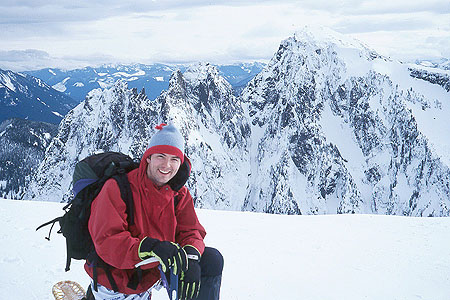
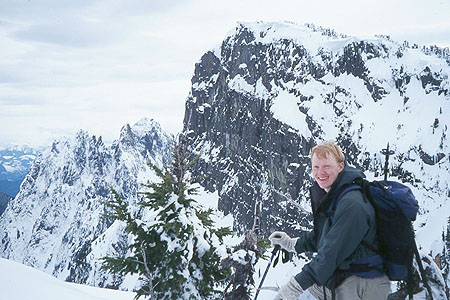
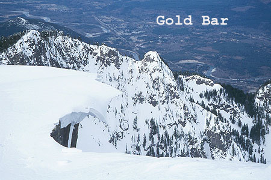
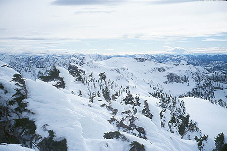
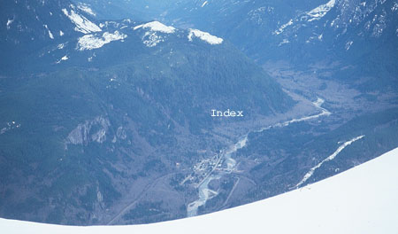

I discovered Mt. Persis the week before on a solo hike.  It was cold, clear and
very windy, but I had such an awesome time that I was eager to show this great
place to Peter.  So less than a week later, we found ourselves tromping up the
snow covered road under high clouds. Quite a bit of snow had melted, allowing us
to drive farther, and changing the character of the climb quite a bit. On the
road we met another duo with similar reasons for being there: one had gone up
last Saturday and was now bringing a friend to share the view.

We had a hard time getting onto the trail. Very thick brush
that was snow-covered last week was now flailing about looking
for an eyeball to pierce. The snow was very soggy and we'd
punch through into a nether chamber from time to time. We had a very
tiring 300 feet through the clear cut
until we could get onto the ridge and better snow. 

Once on the ridge the views opened up, especially of the Proctor
Creek valley below. We switched to snowshoes and climbed an
icy open slope. From there it was back into the trees and then 
out again for a long wonderful climb as the clouds dispersed.
It was actually a pretty warm day. It felt like early April.

We climbed to the false summit, from which the real summit looks very
far away. Peter got this picture of me with the North Face of Persis
behind. There is at least one Grade IV, super hard climbing route on
that. Next we had a long traverse through the trees, trying to find
open terrain beneath the summit massif. We traversed a bit too long,
coming out below a nice level clear area. Peter began to covet my
snappy Denali MSR snowshoes for their traversing ability. He'd had
a tiring job since his couldn't traverse at all, and he was forced
to kick in with his toes on every step! I remained watchful and wary,
lest he pounce!

Now, after a long climb, we were in the really fun territory! Open
slopes, snowy basins, and clearing skies with warm pockets of sun.
The few trees remaining were small and ice-encrusted. Many of them
had a sort of parasitical "ice-twin" of the same size as the
tree. We knocked one or two off, just to be neighborly.

Ah, the summit! The Index Peaks looked super-alpine, like a bit
of Chamonix dropped into western Washington. The view was commanding,
especially of the Skykomish valley, and the narrowing valley leading to
the Monte Cristo peaks, the highest of them were sulking in clouds.
Peter identified Mt. Si to the south, giving us a new perspective on
our position. We could see the tall buildings of Bellevue 30 miles or
so to the south-west. The cliffs of the Index Town Walls were puny 
outcrops far, far below. We were fascinated by a long ridge coming up
from the Steven's Pass highway, and by tremendous cornices overhanging
empty space on the summit. For some reason, Peter's cell phone couldn't
find a signal, so we had no calls to home.

On the way down, Peter ambushed me, stealing my MSR snowshoes. I had
to be content with crampons from my pack, while he sampled the joyful
traction these little plastic shoes provide. I soon forgot the assault
when a small plane came along and we waved to it. The wings tipped
and glinted in the sun: he had seen us! What elemental fun!
Next, we met the duo from the
morning below the summit, and wished them a good final climb. 

The trip down was uneventful, until the final 300 feet of clear-cut.
This last bit took almost an hour, it seemed. The snow was worthless,
and we were forever falling into holes, and clambering out. Finally,
we crashed through the brush and flopped onto the road. A long tiring
walk back to the car finished our climb. 

