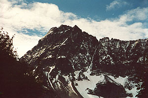
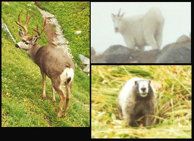
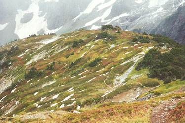
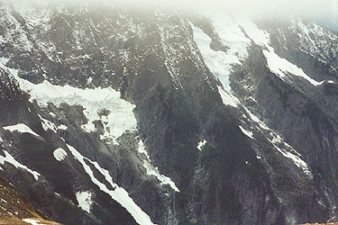
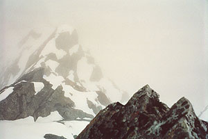
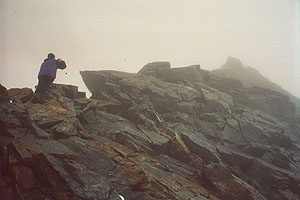
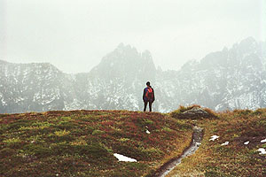

Jeff S. and I took a day off for a climb of Sahale Mountain via
Cascade Pass and Sahale Arm.  The weather hasn't been great in the
mountains over the last few weeks, but Monday was clear, and called
for the same Tuesday. Jeff drove his truck, and in a bizarre incident,
was stopped for speeding in Concrete. He was going 35 mph, consistent
with the signs.  Another sign said to slow to 20 mph when children
were in a crosswalk. There were no children there, but we were stopped
all the same. The officer said "They've been coming through for 15
minutes!" It was hard to know how to reply. But he let Jeff off with
a warning, so we can't complain much.

We finally got to Cascade Pass, 
really enjoying the snow-dusted views
of Johannesburg and the Triplets. The sun was out, and at 9 am, we
started walking. The almost-level Cascade Pass trail takes 3.7 miles
to accomplish what could be done in 1.5 miles.  Talking about this and
that, we reached the pass, and kept going up Sahale Arm.  Moving
fairly quickly, we reached a crest and looked down at Doubtful Lake.
It looked doubtfully back up at us. Marmots roamed across the trail,
paying little attention to us.

This is probably the best view trail I've been on, with pleasant
vistas looking back at the tread winding around and down. All this
heather/pond mixture was topped by Mix-up Peak and the Triplets. But
as we left the heather for extensive boulder-fields, the small cloud
obscuring the summit grew, finally smothering us in a light mist.  We
could see gray weather coming from the west, and mentally prepared for
a view-less vista from "The View Peak of the Cascades." Darn. But on
the other hand, we were out in the weather, in a new place. Soon, we
were on the glacier, cramponing up a moderate slope with some tracks
to follow.

The glacier was quite benign, although we did see two medium-sized
crevasses spanning the slope to the right. We were able to give them a
wide berth. The tracks disappeared in the whiteness upon reaching a
saddle. We rounded the saddle, then went up on a rocky slope with
several inches of fresh snow. We made for a dimly seen ridge left and
up, crossing a worrisome steep slope in the process. At this time of
year, we had about two feet of snow over rocks that seemed as if it
could slide. After 50 feet of this, we arrived at the ridge. Removing
crampons, we avoided the stunningly exposed ridge crest and traversed
lower on the rocks. Pretty quickly this got hard, and increasing rain
convinced us to back off. For some reason, I expected the route to be
around the corner to the right, so we prepared to cross the snow back
that way.  Jeff took a look at the ridge crest though, announcing that
it was blocky and easier than our traverse.

He started up, making quick progress, and I followed. The crux came at
a "5.4" move on wet rock. Jeff pulled through. Not liking the look
of it, I went a bit lower for a "4th class" move. Right after this,
we reached the summit, and the peculiar "Boston Peak" USGS
marker. We had a beautiful vista of gray, some of the best cloud
interior I've ever seen! I took a picture looking down from the tiny
summit, and another of Jeff. Before the rock got too wet, we wanted
off. The down-climb was easier than expected, and soon we were moving
down the snow.

We met two guys at the base of the glacier who were preparing for a
climb of Rainier the next weekend. They were from Michigan, and
together, we admired cloud interiors.  A mountain goat appeared above
their camp, snuffling in the moraine. Now for a long trip down moraine
and boulder-field, finally reaching heather and mud. Coming out of the
cloud, we could admire the views again, using up vast quantities of
film.  A buck was grazing just off the trail, reluctant to let us
pass, and intent on his meal of grasses. We edged around him, then
continued down among chattering marmots.  Really, this was a great
wildlife trip! A goat, a buck and marmots. Oh, and I nearly ate a
hardy mosquito.

Down at Cascade Pass we chatted with an odd visionary, smoking a
hand-rolled cigarette of some sort. We left him to his musings,
mentally girding for the irritating 3.7 mile trip to the car, a mere
2000 feet directly below! We counted over 32 switchbacks, most of them
long, level affairs. Ok, it's time for a "climber's trail" to the
pass!  But we moved quickly, getting to the truck in an hour.

Our "season of delays" wasn't over, since two clueless vehicles
drove 15 mph for much of the 20 mile Cascade River Road. Finally, we
passed them, although they "menaced" us with erratic swervings. The
drive home was long, and we were both pretty tired. I tried to get
excited listening to AM radio baseball, and partially
succeeded. Perhaps in later years, I'll nurse a bottle of orange pop,
read the horse track scores, smoke a cigar and listen to the AM
radio. Or perhaps not.

Jeff and I had some consolation from the panoramic poster of the view
from Sahale at my house. "Ah, so that's what it looks like!"

