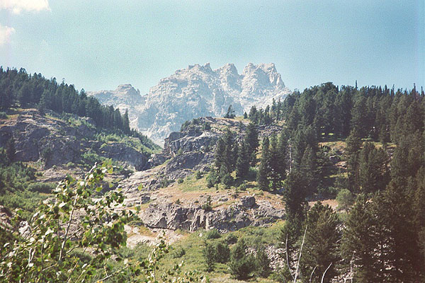
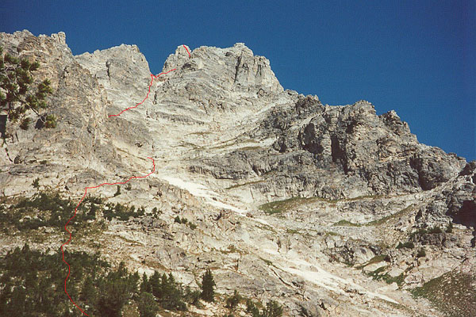
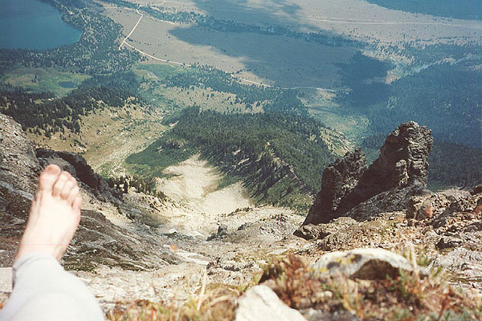
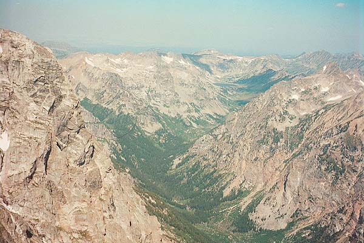
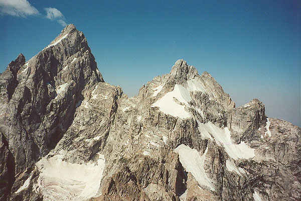
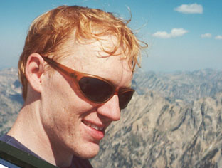

* Mt. Teewinot, East Face
* August 7, 2000

I did a lot of stopping and thinking on this climb. Once the 3000 feet
of hiking up the trail, through pretty meadow and open forest was
over, the hiking becomes very steep and screeish. The East Face rises
up directly above the Lupine Meadows trailhead, and is the most
prominent mountain aspect seen from the valley below. The trip
involves 5500 feet of elevation gain, to over 12,000 feet, and
includes 2000 feet of 3rd and 4th class gullies, slabs and chimneys. I
took my rock shoes for any difficulties, but I didn't bring a rope.

So, as I said, lots of thinking. Hmm...should I climb up that pebble
strewn face to the left, or balance on the icy snow/rock boundary and
frozen mud to the right? It was often difficult to tell which way to
go, because the face breaks up into humpy ridges, steep heather,
gullies and slabs up close. I finally decided that I'd wear boots up,
because I knew I could down-climb in rock shoes whatever I climbed up
in boots.  If I put the rock shoes on now, I could get into more
stressful situations on the descent!  This worked, and allowed me to
continue up without second guessing my choices.

I passed two roped parties, despite breathing heavily in the thin air
at 11,000 feet.  I ended up on the left side of the great gully that
splits the upper face, but I knew I had to get to the right side. At
one point, I looked up to see a great cliff just a few hundred feet
above (impassable), and no apparent way to cross the gully to the
right.  I resigned myself to a high visit at the base of the cliff,
rather than the summit.  But right at the base, I put on my rock
shoes, and went for an exploration, immediately finding a loose but
short down-climb into the gully. Crossing the icy gully, I made my way
up the right side, then around a shoulder with some fun, blocky
scrambling.  The final scramble to the summit was enjoyable, and I
prolonged it by choosing a more difficult variation to the left. On
the false summit, an excellent view down to Storm Point and it's
valley. On the true summit, a stunning picture of the Grand's North
Face, and Mt. Owen. I was above 12,000 ft, and having a grand time!
After gingerly sitting on the highest point, I started the trip down,
moving cautiously but firmly through the tricky parts. I remember a
bold hand traverse on solid rock.  Eventually, I got to the rap
stations I'd passed before, and impressed myself with a new confidence
in the down-climbing. Of course it was easy, but down-climbing has
always made me kind of nervous. Doing so much of it was paying off! A
roped group of three teenagers watched me. I wondered about the wisdom
of their "short rope" strategy. I think they were too close together
on the rope (about 4 feet apart) to stop a fall, but if someone knows
better let me know. I would probably have 15 feet of rope, and let
each person climb a step with a hip belay from above. The difficult
steps never got much higher than that.

Soon I was hiking down steep scree/dust country, looking back at the
improbable "day hike." This was fun. Once on the forested ridge, I
could relax on a good easy trail, and take pleasure in the long
switchbacks it made through meadowed slopes.  I was getting hot and
thirsty, and eagerly drank from the waterfall near the bottom of the
slope. A last look, then the final walk to the car. Teewinot seemed to
shimmer behind a magic curtain far above.

This hike is a great first day of a longer Tetons trip. It gets you
acclimatized, and used to the scree and gullies you'll spend much time
in later!

