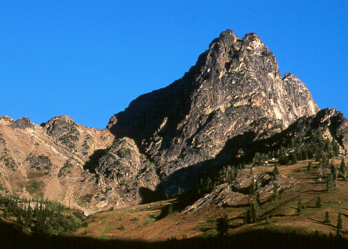
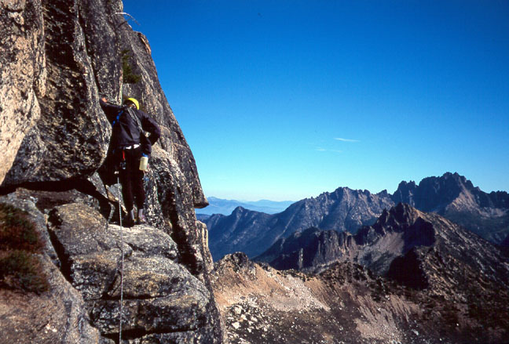
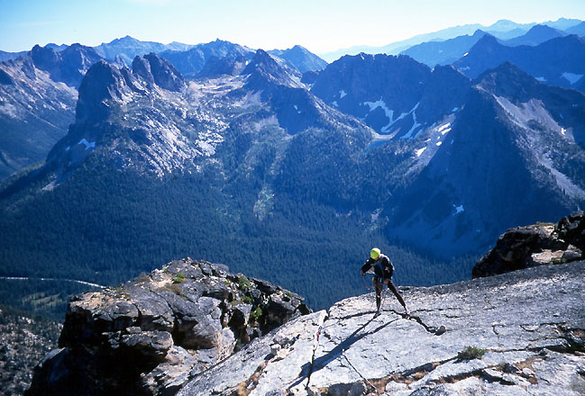
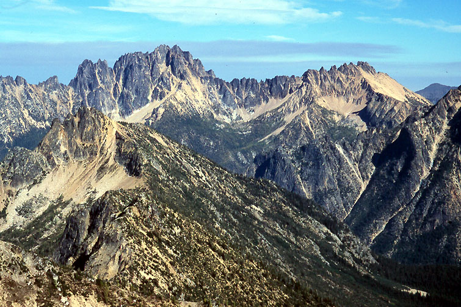
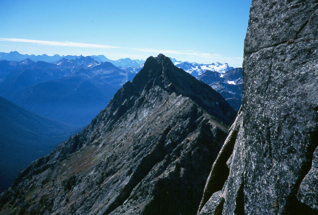
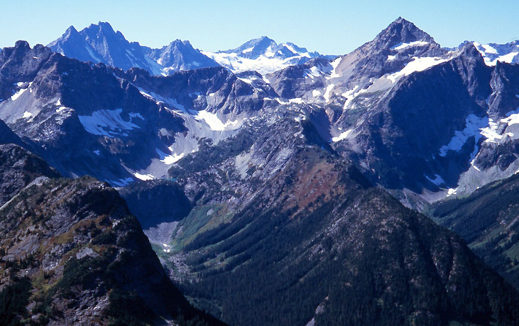
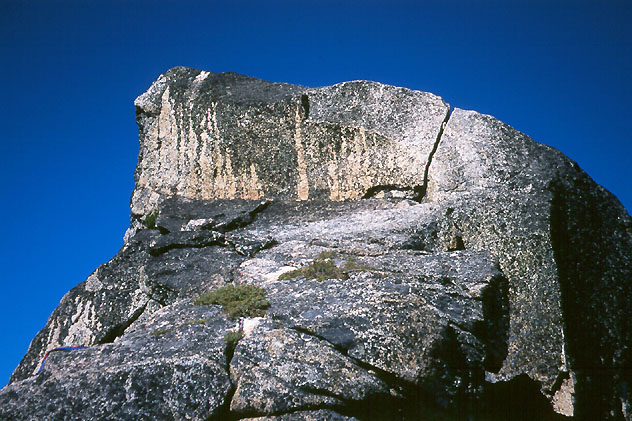
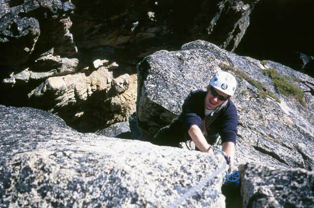
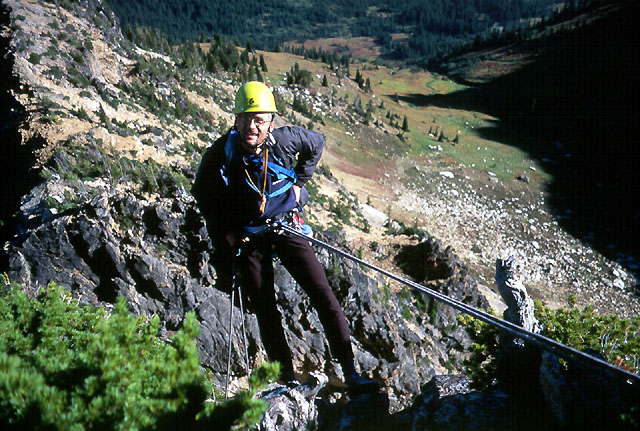

* Cutthroat Peak, South Buttress (5.8)

Chris and I had a nice Sunday climb of this
peak. We reached the trail-head around 8 am, and were on the summit at
12:30. We hung out up there for 2 hours, beginning our descent at 2:30
pm. Many rappels got us to the notch, and scrambling brought us to the
pretty basin in late afternoon. A great climb!

