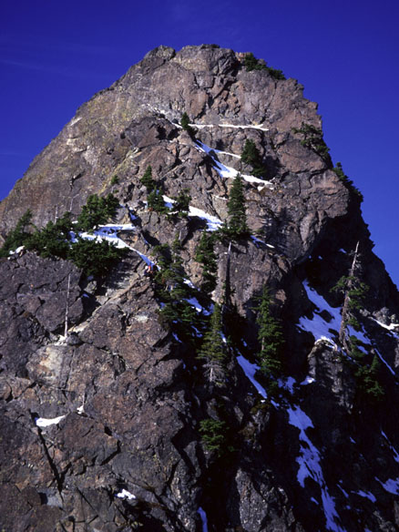
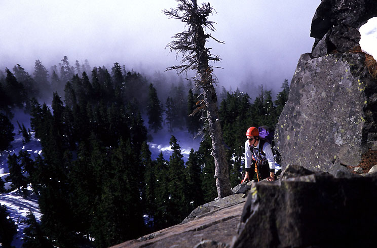
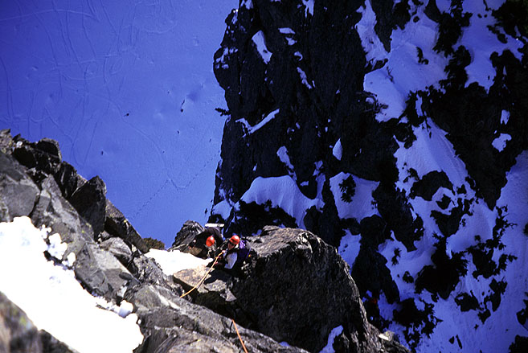
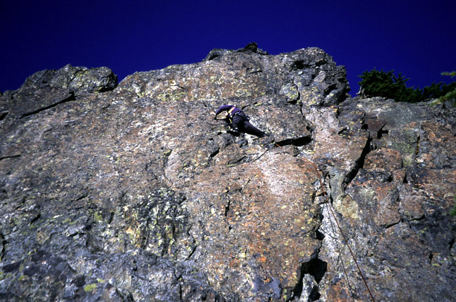
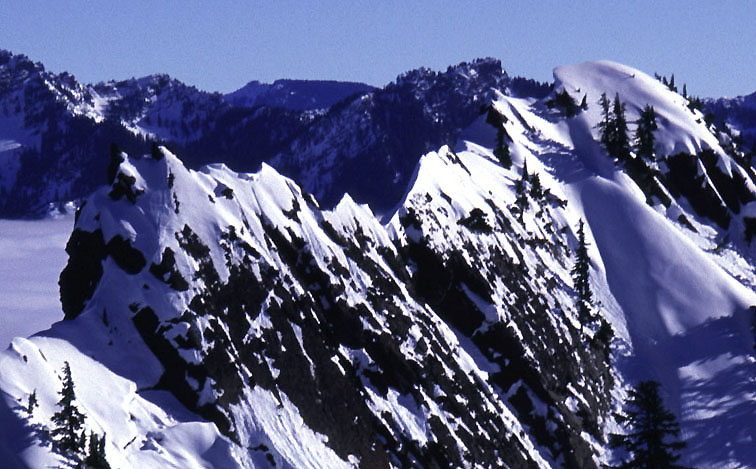
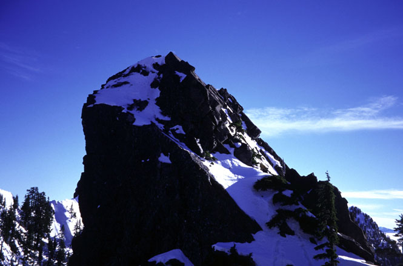
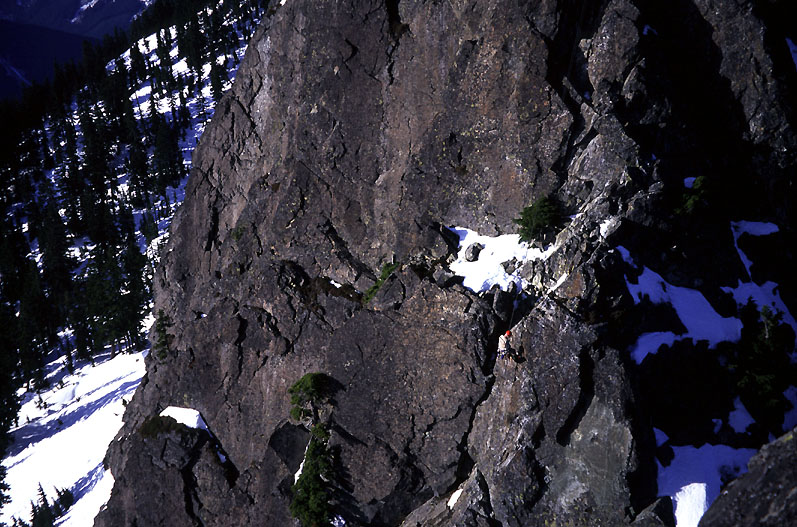

<h2>South Face</h2>
<h3>January 18, 2003</h3>

<i>
Theron and I had a good time climbing the Tooth. We also climbed the little
tower next door, naming it Baby Tooth. We dealt with a crabby party of
Mountaineers. Their shinanigans were entertaining only when
contemplated a month later!
Theron wrote a report, and has a different set of pictures
<a href="http://www.theronwelch.com/mountains/pnw/central/tooth/index.htm">
here.</a> 
</i>

</td>

<td width="30%" valign=top>
<table>
<tr><td>
 
<i>The South Face of the Tooth. Not much snow for winter!</i>
</td></tr>
<tr><td>
 
<i>Theron on pitch two.</i>
</td></tr>
<tr><td>
 
<i>Theron high on the route.</i>
</td></tr>
<tr><td>
 
<i>Climbing the final flakes.</i>
</td></tr>
<tr><td>
 
<i>The view to Denny Ridge (traversed in summer).</i>
</td></tr>
<tr><td>
 
<i>Our next objective: Baby Tooth.</i>
</td></tr>
<tr><td>
 
<i>Abseiling on the Tooth.</i>
