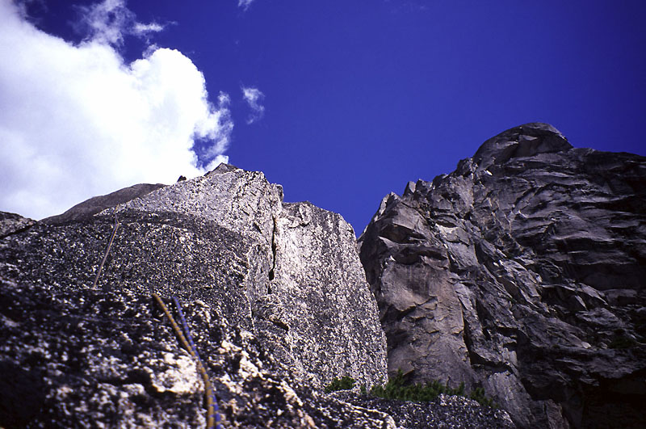
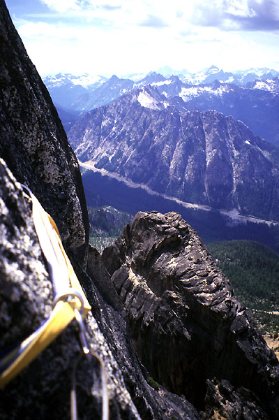
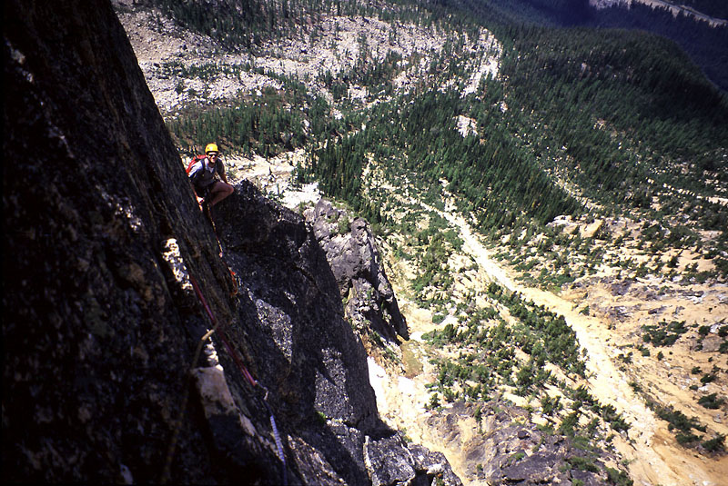
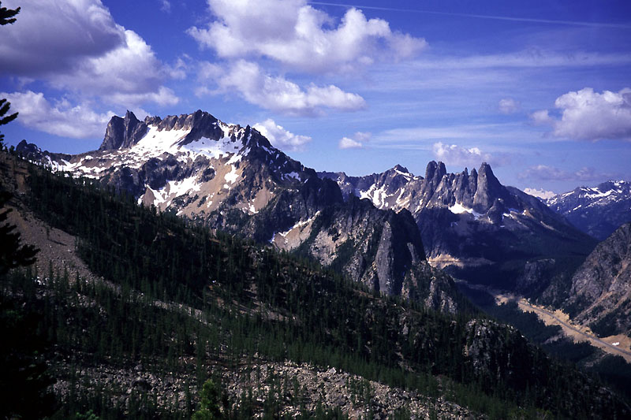
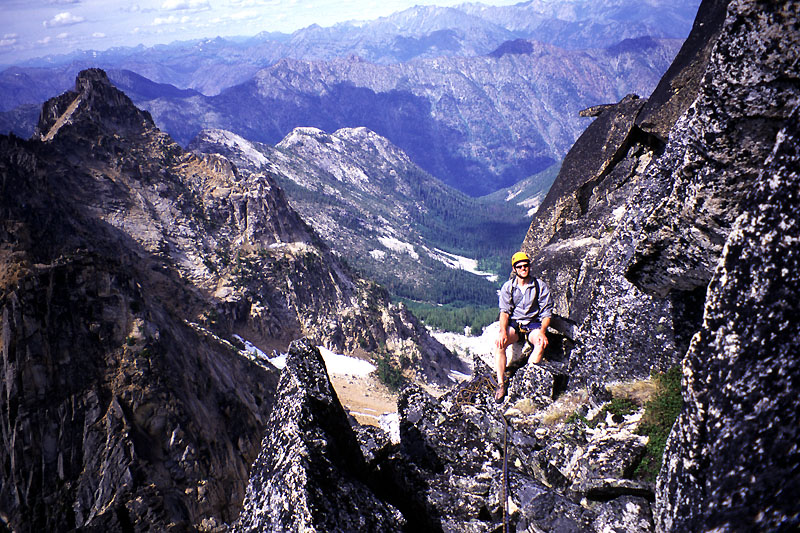
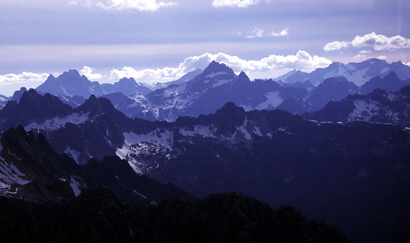
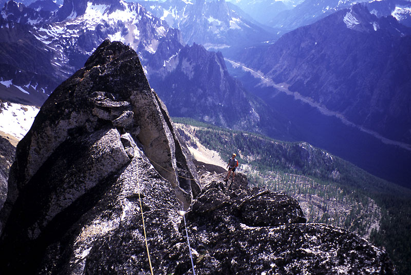
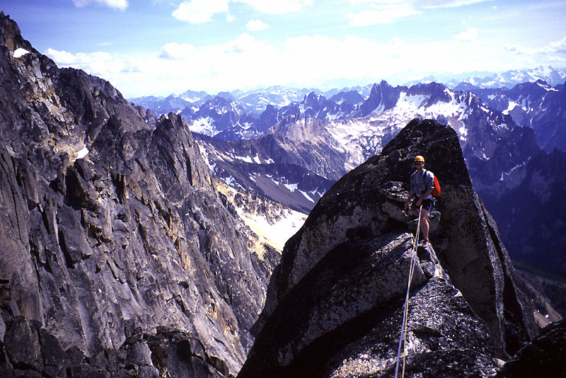
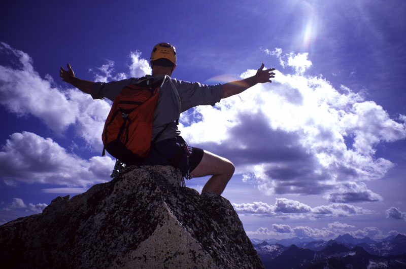
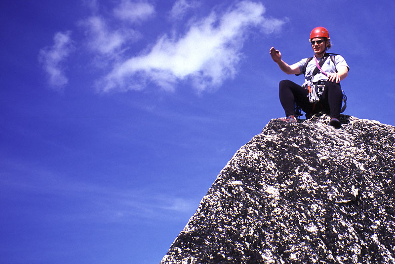

* via Paisano Pinnacle and North Face (5.8)

Robert and I engaged in a frenzy of planning, moving days here and
there to accomodate our voracious need to climb! We eventually ended
up with a 1 day trip to Washington Pass to climb Paisano Pinnacle and
Burgundy Spire. The twist was that I'd leave Robert there, so he and
Julie could go hiking the next day.

We arrived and hiked steeply down to the river, crossed on a shaky
log, and commenced the uphill grind.  I began complaining immediately
about being tired from my attempted climb of Monte Cristo Peak the day
before. "What were you thinking?" said Robert. But before long he
offered to carry the heavy climbing gear in my pack. Although sorely
tempted, I couldn't give in to such a display of unmanliness.  "Maybe
later," I said.

By and by, we made progress on the very steep trail, achieving
stunning viewpoints of spires to the southwest. Mosquitoes weren't
bothering us, which was odd considering the huge dollops of blood they
would extract in the evening. Some parties were coming down, one
boasted of carrying wine, pork roast and other spirited foods up to
the col. "Best thing we ever did," was the hoarse cry. Yet the
permanent hunch under bulging backpacks left us dubious. Perhaps it's
better to carry a bottle of wine, a sharp knife, and a leash attached
to a lamb up there for a hideous Bacchanal!

Folks were dubious of our plan to climb the two towers as a day
trip. But we've learned you can always climb faster. Or rather, it's
not the climbing, it's the belaying that slows you down. It really
helps to have a "Camelback" too. No more excuses to stop and mop the
sweat from your palms, pretending to fumble for water until your
partner gets impatient enough to lead "Weeping Death Pitch IV."

Anyway, Robert led us to a secret stream for more water (My Camelback
suffers from a high leakage rate, so my backside was always nice and
damp). Then some more scrambling uphill brought us to the base of
Paisano Pinnacle. We wanted to climb the West Buttress, a 5.9 (?)
route first climbed in 1971.  Considering that when I started
"climbing," my goal was to do climbs less than a century old, getting
onto something from the year of my birth was pretty happy news. Aside
from the moistened backside.

We scrambled up to a ledge on the obvious buttress and roped
up. Robert took off, finding tricky climbing just around the corner. I
scrabbled up a corner crack, then began heaving on a solitary green
branch snaking down the cliff. In this mountain range, brush is always
stronger than people, so my trust was unexamined. We walked up a
gentle stretch of ridge, extensively groomed by someone with a
hacksaw, leaving neatly trimmed gnarled shrubs to keep the path
clear. I used the term "Klettergarten," and we were off on a Deutsche
theme for hours. Some real climbing on clean granite took us to a
ledge below steep walls. Here we met the crux of the route: a steep
hand crack leading to bulges and fingerlocks.  Since a few
non-climbers might still read this, a fingerlock is a hole in the rock
in which your fingers can be placed semi-permanently. The object is to
stuff enough fingers in there that they won't come out no matter
what. "Finger Locks or Pine Box," as Robert likes to say.

Robert led me up this pitch, then I crabbed across a wall looking for
a way up. The rock looked beautiful - too bad none of it was
attached. I placed a lot of gear, half-expecting each nubbin to
collapse under my weight. Once back on the ridgecrest, the climbing
eased. Robert took off for a long simul-climbing pitch to the
summit. We had fun wandering along the ridge. Just below the summit
was a tricky face climbing move that Robert had expertly protected
with a steel nut in a small pocket on the slab.

We hung out a few minutes, admiring my tiny car so far below (almost a
vertical mile), and started looking at Burgundy Spire. A bit of trivia
we repeated often is that it's the hardest principle summit in the
Cascades to reach by any route. We climbed down easy rock from the
summit of Paisano and stashed our boots and other unnecessary gear at
the base of the first cliff. Another party, Cliff and Michael, were
just starting up. The lower face was broad, so Robert easily found a
vast swath of slabs and cracks we could climb far to the right of
them. He quickly ran the rope out and I followed for a simul-climbing
pitch through some spectacular climbing. A series of 5.8 cracks snaked
steeply up, accepting hands and feet for secure climbing. A good hand
crack is like a belay ledge, someone once said.

Now on a broad bench, we followed it around to the right, going
through a tunnel with snow. Cautioned to keep walking for a ways more,
we scrambled to a ridge crest at the end of the bench. Here we saw a
nice hand crack above us. By now all my water had dribbled out of my
leaky Camelback, so my skin began to "paper" alarmingly. Before I
turned to dust, I scrabbled up to the hand crack, which was actually
off route. Should you want to climb it, it is about 5.8, sustained for
3-4 moves, and festooned with the most fascinatingly thick hunks of
lichen you've ever seen. This left me on the left side of the ridge
crest, and I was now subjected to Robert hollering about the need to
enter the dihedral on the right.  "Keep cool, my babies!" I said. To
myself that is. Just before giving up and downclimbing I found a sly
ledge amid smooth slabs that let me traverse back to the right. Now I
was in the sanctioned dihedral, and enjoyed the great moderate
climbing up the long V for 80 feet or so.

I didn't let Robert know I was belaying at a sturdy ledge, so he faced
licheny horrors on the hand-crack.  Always saavy, he would move the
cam I'd placed up the crack bit by bit to protect his ascent. Still, I
could practically hear the crunching of lichen 100 feet below. After
admiring the view from this great bivy ledge, we sent me off with the
"boat anchor" 3.5 cam carried all this way for a supposed wide crack
pitch. First, thin face climbing moves with an occasional Pine Box
took me up golden rock, then I rounded a corner to find the wide
crack/chimney. I left the "boat anchor/old maid" at the base, and
threw myself at the crack. Wide cracks are too big for your hands and
too small for your body, so you compromise by rattling your arm around
inside. Feeling vaguely foolish, I used small features on the face to
move up and rattled my arm for show in the crack. Finally the siege
was over and I made slow-motion hero moves on a knife edge ridge
crest. As the music swelled I carved out my domain next to the summit
block, and brought Robert up from a sturdy belay anchor. Only one
person could sit on the true summit at a time, so we took turns
thundering at the masses below from our bully pulpit.

Robert thought we could rappel into a notch and climb to the summit of
Chianti Spire. We fixed a single line, and he rapped into the deep
notch. It was revealed that we'd have at least 80 feet of free-hanging
prussiking to get back up. I wasn't keen on that, having forgotten my
prussiks and feeling dubious about executing the task with slippery
Spectra slings. So he came back up, enjoying some 5.10 chimney
climbing on top-rope.

We descended, getting a rope stuck on the first double rope
rap. Robert was able to scramble up ledges 50 feet to retrieve it. We
made 2-3 more rappels to reach our packs, then 2 more rappels to reach
Burgundy Col. Robert did some difficult downclimbing instead, perhaps
impatient with the tiresome coiling and uncoiling. At the col we ate
some food and said hello to a mountain goat. Soon we were bombing down
the scree, trying not to think about the long steep trail ahead. Late
afternoon shadows spread from the peaks around, and soon, above us
rather than level.

After the long walk down, we found an easier log to cross the creek,
and hiked tiredly up to the car.  I think it was 13 hours round
trip. A new adventure began now, because we'd left the lights on and
the battery was dead. Great!

We waited for Cliff and Michael to arrive. They were most excellent
companions, sharing a beer with us, and giving us a ride to a
campground down the road where Robert expected Julie to arrive the
next morning.  I didn't have a sleeping bag, so I took a blanket Kris
kept in the car for naps. Near the campground, we found a tow truck,
who promised to come back around 1 am and meet me on the road. So I
rested by the fire Robert built for an hour or so, warm in my
blanket. 'Round midnight I took myself and the blanket for a lonely
walk on the highway. Stopping to laze on occasion, I heard the truck
coming just as I was contemplating climbing down to Cutthroat Creek
for some water. He gave me a jump, and I was finally on my way home. I
napped for a few hours near Darrington, and made home at 6 am.

I thought Peter might call to go climbing that morning, but I guess I
was lucky it rained so I could sleep in!  Thanks to Robert for a great
climb!

Detailed notes
------------

Here are the pitches for Paisano Pinnacle:

1. Robert climbed a 5.8 pitch, 50 meters.
2. I walked 50 meters up to a cliff
3. I led a nice 5.6 crack up to a big ledge below a steep crack, 40 meters?
4. Robert led the 5.9 steep crack and then fingerlocks and face climbing next to a chimney. 30 Meters.
5. I traversed a vertical wall 5 meters, then up rotten rock to gain the ridge crest. (5.8). Good pro was found in the kitty litter. I climbed up a distance on the crest to a ledge.
6. Robert strung two pitches together in 100 meters of simul-climbing. Exciting bit of 5.8 face climbing just below the summit.

Burgundy Spire had the following pitches:

1. Robert led a long simul-climbing pitch of 100 meters that included the 5.8 crux of the route, steller hand cracks leading to a broad bench/ledge.
2. After walking across and down the ledge, I led up a ridge crest, getting off the standard route by following an enticing 5.8 hand crack covered in lichen. Higher up, regained the crest with a rightward traverse on a ledge, then a long fun dihedral. 50 meters.
3. I led a 5.7 face with fingerlocks in a thin crack. Above this was a 5.7 wide crack/chimney that led to the summit ridge. 45 meters.

