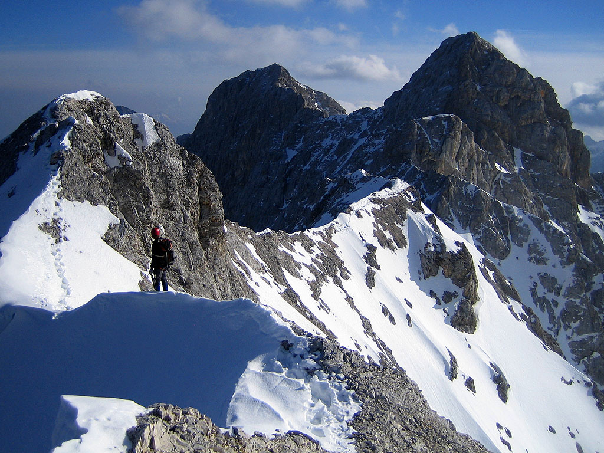

<h2>Winter climb between the Zugspitze and Alpspitze</h2>
<h3>February, 2007</h3>

All photos by Daniel Arndt. Details coming (hopefully) soon....great trip!

<table>
<tr><td>
 
<i>Daniel casts off, early on the route</i>
</td></tr>
<tr><td>
 
<i>The Zugspitze, with summit Funplex</i>
</td></tr>
<tr><td>
 
<i>Michael marches into rockier terrain</i>
</td></tr>
<tr><td>
 
<i>We'll follow the ridge all the way left and beyond</i>
</td></tr>
<tr><td>
 
<i>Climbing in crampons was fun!</i>
</td></tr>
<tr><td>
 
<i>The ups and downs got bigger each time!</i>
</td></tr>
<tr><td>
 
<i>This zoom-in shows the tiny scale of people (circled).</i>
</td></tr>
<tr><td>
 
<i>Daniel on another tower</i>
</td></tr>
<tr><td>
 
<i>Daniel climbs as the weather worsens</i>
</td></tr>
<tr><td>
 
<i>Clouds are filling the Reintal</i>
</td></tr>
<tr><td>
 
<i>Melting snow in the nice bivouac hut</i>
</td></tr>
<tr><td>
 
<i>The valley behind these Wetterstein summits had an eerie glow.</i>
</td></tr>
<tr><td>
 
<i>Our shelter-mates are coming along the ridge in the morning</i>
</td></tr>
<tr><td>
 
<i>There is usually a fixed rope when things are really steep.</i>
</td></tr>
<tr><td>
 
<i>Setting up a rappel.</i>
</td></tr>
<tr><td>
 
<i>Descending a fixed cable.</i>
</td></tr>
<tr><td>
 
<i>Michael rappels from the Volkarspitze</i>
</td></tr>
<tr><td>
 
<i>The east side of the Volkarspitze, with three climbers.</i>
</td></tr>
<tr><td>
 
<i>Our friends descending to the Grieskar notch</i>
</td></tr>
<tr><td>
 
<i>Descending endless snow slopes</i>
</td></tr>
<tr><td>
 
<i>Heavy snowfall as we descend.</i>
</td></tr>
<tr><td>
 
<i>The Wetterstein Range at sunrise.</i>
</td></tr>
<tr><td>
 
<i>The Zugspitze, the Hoellental peaks and the Hochblassen on the left.</i>
</td></tr>
</table>
